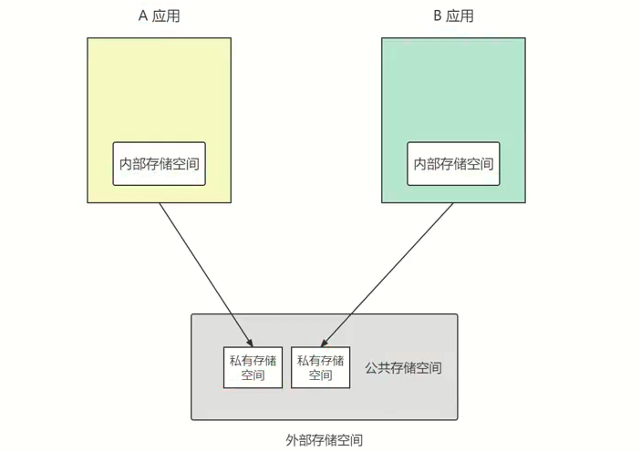

# 储存卡的文件操作

## 私有存储空间与公共存储空间

Android把外部存储分成了两块区域，一块是所有应用均可访问的公共空间，另一块是只有应用自己才可访问的私有空间。




## 在存储卡上读写文本文件

```java
import java.io.BufferedReader;
import java.io.BufferedWriter;
import java.io.FileReader;
import java.io.FileWriter;
import java.io.IOException;

public class FileUtil {
    public static void saveText(String path, String txt) {
        BufferedWriter os = null;
        try {
            os = new BufferedWriter(new FileWriter(path));
            os.write(txt);
        } catch (IOException e) {
            e.printStackTrace();
        } finally {
            if (os != null) {
                try {
                    os.close();
                } catch (IOException e) {
                    e.printStackTrace();
                }
            }
        }
    }

    public static String openText(String path) {
        BufferedReader is = null;
        StringBuilder sb = new StringBuilder();
        try {
            is = new BufferedReader(new FileReader(path));
            String line = null;
            while ((line = is.readLine()) != null) {
                sb.append(line);
            }
            is.read();
        } catch (IOException e) {
            e.printStackTrace();
        } finally {
            if (is != null) {
                try {
                    is.close();
                } catch (IOException e) {
                    e.printStackTrace();
                }
            }
        }
        return sb.toString();
    }
}
```

## 在存储卡上读写图片文件

Android 的位图工具是Bitmap，App读写Bitmap可以使用性能更好的BufferedOutputStream和BufferedInputStream。

Android还提供了BitmapFactory工具用于读取各种来源的图片，相关方法如下：

- decodeResource：该方法可从资源文件中读取图片信息。
- decodeFile：该方法可将指定路径的图片读取到Bitmap对象。
- decodeStream：该方法从输入流中读取位图数据。


```java
public static void writeImage(String path, Bitmap bitmap) {
    FileOutputStream fos = null;
    try {
        fos = new FileOutputStream(path);
        bitmap.compress(Bitmap.CompressFormat.PNG, 100, fos);
    } catch (FileNotFoundException e) {
        e.printStackTrace();
    } finally {
        if (fos != null) {
            try {
                fos.close();
            } catch (IOException e) {
                e.printStackTrace();
            }
        }
    }
}

public static Bitmap readImage(String path) {
    Bitmap bitmap = null;
    FileInputStream fis = null;
    try {
        fis = new FileInputStream(path);
        bitmap = BitmapFactory.decodeStream(fis);
    } catch (FileNotFoundException e) {
        e.printStackTrace();
    }finally {
        if (fis!=null){
            try {
                fis.close();
            } catch (IOException e) {
                e.printStackTrace();
            }
        }
    }
    return bitmap;
}
```