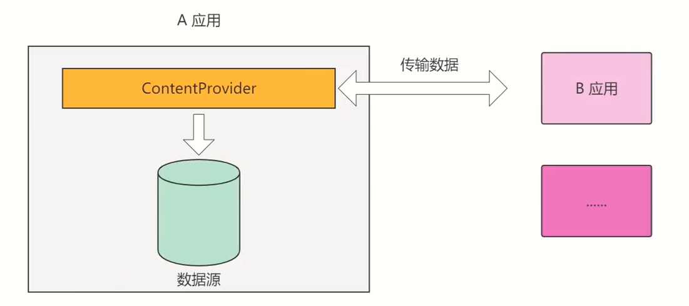
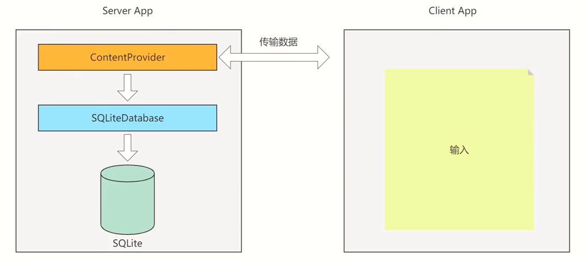
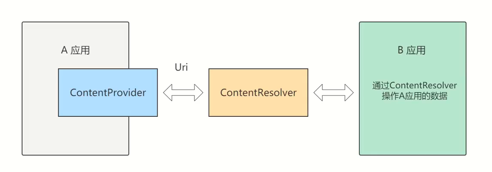
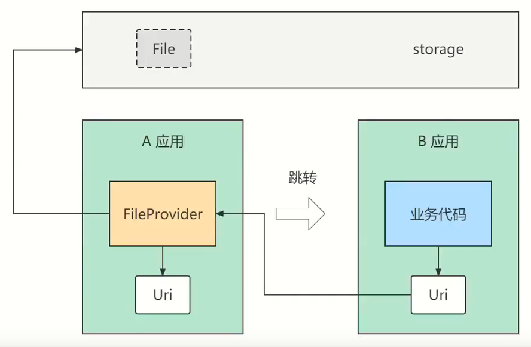

# 内容共享

- [内容共享](#内容共享)
  - [在应用之间共享数据](#在应用之间共享数据)
    - [通过ContentProvider封装数据](#通过contentprovider封装数据)
    - [通过ContentResolver访问数据](#通过contentresolver访问数据)
  - [使用内容组件获取通讯信息](#使用内容组件获取通讯信息)
    - [运行时动态申请权限](#运行时动态申请权限)
    - [利用ContentResolver读写联系人](#利用contentresolver读写联系人)
    - [利用ContentObserver监听短信](#利用contentobserver监听短信)
  - [在应用之间共享文件](#在应用之间共享文件)
    - [使用相册图片发送彩信](#使用相册图片发送彩信)
    - [借助FileProvider发送彩信](#借助fileprovider发送彩信)
    - [借助FileProvider安装应用](#借助fileprovider安装应用)

## 在应用之间共享数据

ContentProvider为App存取内部数据提供统一的外部接口，让不同的应用之间得以共享数据。



Client App 将用户的输入内容，通过ContentProvider跨进程通信传递给Server Appo



### 通过ContentProvider封装数据

ContentProvider只是服务端App存取数据的抽象类，我们需要在其基础上实现一个完整的内容提供器，并重写下列方法。

- onCreate：创建数据库并获得数据库连接。
- insert：插入数据。
- delete：删除数据。
- update：更新数据。
- query：查询数据，并返回结果集的游标。
- getType：获取内容提供器支持的数据类型。

Uri（通用资源标识符Universal Resource ldentifer），代表数据操作的地址，每一个ContentProvider都会有唯一的地址。ContentProvider使用的Uri语法结构如下：

`content://authority/data_path/id`
- `content://`是通用前缀，表示该Uri用于ContentProvider定位资源。
- `authority`是授权者名称，用来确定具体由哪一个ContentProvider提供资源。因此一般authority都由类的小写全称组成，以保证唯一性。
- `data_path`是数据路径，用来确定请求的是哪个数据集。
- `id` 是数据编号，用来请求单条数据。如果是多条这个字段忽略。


### 通过ContentResolver访问数据

利用ContentProvider只实现服务端App的数据封装，如果客户端App想访问对方的内部数据,就要通过内容解析器ContentResolver访问。




## 使用内容组件获取通讯信息

### 运行时动态申请权限

Android系统为了防止某些App滥用权限，从6.0开始引入了运行时权限管理机制，允许App在运行过程中动态检查是否拥有某项权限，一旦发现缺少某种必需的权限，则系统会自动弹出小窗提示用户去开启该权限。

**动态申请权限的步骤**

（1）检查App是否开启了指定权限

- 调用ContextCompat的checkSelfPermission方法。

（2）请求系统弹窗，以便用户选择是否开启权限

- 调用ActivityCompat的requestPermissions方法，即可命令系统自动弹出权限申请窗口。

（3）判断用户的权限选择结果

- 重写活动页面的权限请求回调方法onRequestPermissionsResult，在该方法内部处理用户的权限选择结果。


### 利用ContentResolver读写联系人

写入联系人有两种：

**方式一：直接写入**
```java
private void addContacts(ContentResolver resolver, Contact contact) {
    ContentValues values = new ContentValues();
    Uri uri = resolver.insert(RawContacts.CONTENT_URI, values);
    long rawContactId = ContentUris.parseId(uri);
    ContentValues name = new ContentValues();
    name.put(Contacts.Data.RAW_CONTACT_ID, rawContactId);
    name.put(Contacts.Data.MIMETYPE, CommonDataKinds.StructuredName.CONTENT_ITEM_TYPE);
    name.put(Contacts.Data.DATA2, contact.name);
    resolver.insert(Data.CONTENT_URI, name);

    ContentValues phone = new ContentValues();
    phone.put(Contacts.Data.RAW_CONTACT_ID, rawContactId);
    phone.put(Contacts.Data.MIMETYPE, CommonDataKinds.Phone.CONTENT_ITEM_TYPE);
    phone.put(Contacts.Data.DATA1, contact.phone);
    phone.put(Contacts.Data.DATA2, CommonDataKinds.Phone.TYPE_MOBILE);// 类型
    resolver.insert(Data.CONTENT_URI, phone);

    ContentValues email = new ContentValues();
    email.put(Contacts.Data.RAW_CONTACT_ID, rawContactId);
    email.put(Contacts.Data.MIMETYPE, CommonDataKinds.Email.CONTENT_ITEM_TYPE);
    email.put(Contacts.Data.DATA1, contact.email);
    email.put(Contacts.Data.DATA2, CommonDataKinds.Email.TYPE_WORK);// 类型：工作
    resolver.insert(Data.CONTENT_URI, email);
}
```
**方式二：批处理方式**

每一次操作都是一个 ContentProviderOperation，构建一个操作集合，然后一次性执行

好处是，要么全部成功，要么全部失败，保证了事务的一致性

```java
private void addFullContact(ContentResolver resolver, Contact contact) {
    ContentProviderOperation op_main = ContentProviderOperation.newInsert(RawContacts.CONTENT_URI)
            .withValue(RawContacts.ACCOUNT_NAME, null)
            .build();
    ContentProviderOperation op_name = ContentProviderOperation.newInsert(Data.CONTENT_URI)
            //将第O个操作的id，即 raw contacts 的 id 作为 data表中的 raw_contact_id
            .withValueBackReference(Contacts.Data.RAW_CONTACT_ID, 0)
            .withValue(Contacts.Data.MIMETYPE, CommonDataKinds.StructuredName.CONTENT_ITEM_TYPE)
            .withValue(Contacts.Data.DATA2, contact.name)
            .build();

    ContentProviderOperation op_phone = ContentProviderOperation.newInsert(Data.CONTENT_URI)
            //将第O个操作的id，即 raw contacts 的 id 作为 data表中的 raw_contact_id
            .withValueBackReference(Contacts.Data.RAW_CONTACT_ID, 0)
            .withValue(Contacts.Data.MIMETYPE, CommonDataKinds.Phone.CONTENT_ITEM_TYPE)
            .withValue(Contacts.Data.DATA1, contact.phone)
            .withValue(Contacts.Data.DATA2, CommonDataKinds.Phone.TYPE_MOBILE)
            .build();

    ContentProviderOperation op_email = ContentProviderOperation.newInsert(Data.CONTENT_URI)
            //将第O个操作的id，即 raw contacts 的 id 作为 data表中的 raw_contact_id
            .withValueBackReference(Contacts.Data.RAW_CONTACT_ID, 0)
            .withValue(Contacts.Data.MIMETYPE, CommonDataKinds.Email.CONTENT_ITEM_TYPE)
            .withValue(Contacts.Data.DATA1, contact.email)
            .withValue(Contacts.Data.DATA2, CommonDataKinds.Email.TYPE_WORK)
            .build();

    ArrayList<ContentProviderOperation> operations = new ArrayList<>();
    operations.add(op_main);
    operations.add(op_name);
    operations.add(op_phone);
    operations.add(op_email);

    try {
        resolver.applyBatch(AUTHORITY, operations);
    } catch (OperationApplicationException e) {
        e.printStackTrace();
    } catch (RemoteException e) {
        e.printStackTrace();
    }
}
```
查询联系人：
```java
@SuppressLint("Range")
private void readPhoneContacts(ContentResolver resolver) {
    Cursor cursor = resolver.query(RawContacts.CONTENT_URI, new String[]{RawContacts._ID}, null, null, null);
    while (cursor.moveToNext()) {
        int rawContactId = cursor.getInt(0);
        Uri uri = Uri.parse("content://com.android.contacts/contacts/" + rawContactId + "/data");
        Cursor dataCursor = resolver.query(uri, new String[]{Contacts.Data.MIMETYPE, Contacts.Data.DATA1, Contacts.Data.DATA2}, null, null, null);
        Contact contact = new Contact();
        while (dataCursor.moveToNext()) {
            String data1 = dataCursor.getString(dataCursor.getColumnIndex(Contacts.Data.DATA1));
            String mimeType = dataCursor.getString(dataCursor.getColumnIndex(Contacts.Data.MIMETYPE));
            switch (mimeType) {
                case CommonDataKinds.StructuredName.CONTENT_ITEM_TYPE:
                    contact.name = data1;
                    break;
                case CommonDataKinds.Phone.CONTENT_ITEM_TYPE:
                    contact.phone = data1;
                    break;
                case CommonDataKinds.Email.CONTENT_ITEM_TYPE:
                    contact.email = data1;
                    break;
            }
        }
        dataCursor.close();
        if (contact.name != null) {
            Log.d("yu", contact.toString());
            tvContacts.setText(tvContacts.getText() + contact.toString() + "\n");
        }
    }
    cursor.close();
}
```

### 利用ContentObserver监听短信

内容观察器ContentObserver给目标内容注册一个观察器，目标内容的数据一旦发生变化，观察器规定好的动作马上触发，从而执行开发者预先定义的代码。

```java
public class MonitorSmsActivity extends AppCompatActivity {

    private SmsGetObserver mObserver;
    private TextView tvSms;

    @Override
    protected void onCreate(Bundle savedInstanceState) {
        super.onCreate(savedInstanceState);
        setContentView(R.layout.activity_monitor_sms);
        tvSms = findViewById(R.id.tv_sms);
        Uri uri = Uri.parse("content://sms");
        // notifyForDescendents:
        // false :表示精确匹配，即只匹配该Uri，true :表示可以同时匹配其派生的Uri//假设UriMatcher里注册的Uri共有一下类型:
        // 1.content://AUTHORITIES/table
        // 2.content://AUTHORITIES/table/#
        // 3.content://AUTHORITIES/table/subtable
        // 假设我们当前需要观察的Uri为content : //AUTHORITIES/student/如果发生数据变化的uri 为 3。
        // 当notifyForDescendents为false，那么该ContentObserver会监听不到，但是当notifyForDescendents为true,则可以监听到
        mObserver = new SmsGetObserver(this);
        getContentResolver().registerContentObserver(uri, true, mObserver);
    }

    @Override
    protected void onDestroy() {
        super.onDestroy();
        getContentResolver().unregisterContentObserver(mObserver);
    }

    public static class SmsGetObserver extends ContentObserver {

        private final Context mContext;

        public SmsGetObserver(Context context) {
            super(new Handler(Looper.getMainLooper()));
            this.mContext = context;
        }

        @SuppressLint("Range")
        @Override
        public void onChange(boolean selfChange, @Nullable Uri uri) {
            super.onChange(selfChange, uri);
            // onChange会多次调用，收到一条短信会调用两次onChange
            // mUri===content://sms/raw/20
            // mUri===content://sms/inbox/20
            // 安卓7.0以上系统，点击标记为已读，也会调用一次
            // mUri===content://sms
            // 收到一条短信都是uri后面都会有确定的一个数字，对应数据库的_id，比如上面的20
            if (uri == null) {
                return;
            }
            if (uri.toString().contains("content://sms/raw") ||
                    uri.toString().equals("content://sms")) {
                return;
            }
            //通过内容解析器获取符合条件的结果集游标
            Cursor cursor = mContext.getContentResolver().query(uri, new String[]{"address", "body", "date"}, null, null, "date DESC");
            if (cursor.moveToNext()) {
                String sender = cursor.getString(cursor.getColumnIndex("address"));
                String content = cursor.getString(cursor.getColumnIndex("body"));
                Log.d("yu", String.format("sender:%s,content:%s", sender, content));
                ToastUtil.show(mContext,String.format("sender:%s,content:%s",sender, content));
            }
            cursor.close();
        }
    }
}
```

## 在应用之间共享文件

### 使用相册图片发送彩信

```java
@SuppressLint("Range")
private void loadImageList() {
    // MediaStore
    String[] columns = new String[]{
            MediaStore.Images.Media._ID,
            MediaStore.Images.Media.TITLE,
            MediaStore.Images.Media.SIZE,
            MediaStore.Images.Media.DATA // 文件路径
    };
    Cursor cursor = getContentResolver().query(
            MediaStore.Images.Media.EXTERNAL_CONTENT_URI,
            columns,
            "_size<307200",
            null,
            "_size DESC"
    );
    int count = 0;
    if (cursor != null) {
        while (cursor.moveToNext() && count < 6) {
            ImageInfo image = new ImageInfo();
            image.id = cursor.getLong(cursor.getColumnIndex(MediaStore.Images.Media._ID));
            image.name = cursor.getString(cursor.getColumnIndex(MediaStore.Images.Media.TITLE));
            image.size = cursor.getLong(cursor.getColumnIndex(MediaStore.Images.Media.SIZE));
            image.path = cursor.getString(cursor.getColumnIndex(MediaStore.Images.Media.DATA));
            count++;
            mImageList.add(image);
            Log.d("yu", "loadImageList: " + image.toString());
        }
    }
}
```

### 借助FileProvider发送彩信

FileProvider继承于ContentProvider，对第三方应用暴露文件，并授予文件读写操作的权限。



FileUtil类：
```java
// 检查文件是否存在，以及文件路径是否合法
public static boolean checkFileUri(Context ctx, String path) {
    File file = new File(path);
    Log.d("yu", "oldPath" + path);
    if (!file.exists() || !file.isFile() || file.length() <= 0) {
        return false;
    }
    try {
        // 检测文件路径是否支持FileProvider访问方式，如果发生异常，说明不支持
        if (Build.VERSION.SDK_INT >= Build.VERSION_CODES.N) {
            FileProvider.getUriForFile(ctx, ctx.getString(R.string.file_provider), file);
        }
    } catch (Exception e) {
        e.printStackTrace();
        return false;
    }
    return true;
}
```

Activity类：
```java
@SuppressLint("Range")
private void loadImageList() {
    // MediaStore
    String[] columns = new String[]{
            MediaStore.Images.Media._ID,
            MediaStore.Images.Media.TITLE,
            MediaStore.Images.Media.SIZE,
            MediaStore.Images.Media.DATA // 文件路径
    };
    Cursor cursor = getContentResolver().query(
            MediaStore.Images.Media.EXTERNAL_CONTENT_URI,
            columns,
            "_size<307200",
            null,
            "_size DESC"
    );
    int count = 0;
    if (cursor != null) {
        while (cursor.moveToNext() && count < 6) {
            ImageInfo image = new ImageInfo();
            image.id = cursor.getLong(cursor.getColumnIndex(MediaStore.Images.Media._ID));
            image.name = cursor.getString(cursor.getColumnIndex(MediaStore.Images.Media.TITLE));
            image.size = cursor.getLong(cursor.getColumnIndex(MediaStore.Images.Media.SIZE));
            image.path = cursor.getString(cursor.getColumnIndex(MediaStore.Images.Media.DATA));
            if (FileUtil.checkFileUri(this, image.path)) {
                count++;
                mImageList.add(image);
                Log.d("yu", "loadImageList: " + image.toString());
            }

        }
    }
}

private void sendMms(String phone, String title, String message, String path) {
    Uri picUrl = Uri.parse(path);
    //兼容Android7.0，把访问文件的Uri方式改为FileProvider
    if (Build.VERSION.SDK_INT >= Build.VERSION_CODES.N) {
        picUrl = FileProvider.getUriForFile(this, getString(R.string.file_provider), new File(path));
        Log.d("yu", "sendMms: " + picUrl.toString());
    }
    Intent intent = new Intent(Intent.ACTION_SEND);
    intent.addFlags(Intent.FLAG_ACTIVITY_NEW_TASK);
    // Intent的接受者将被准许读取Intent携带的UR工数据
    intent.addFlags(Intent.FLAG_GRANT_READ_URI_PERMISSION);
    intent.putExtra("address", phone);
    intent.putExtra("subject", title);
    intent.putExtra("sms_body", message);
    intent.putExtra(Intent.EXTRA_STREAM, picUrl);
    intent.setType("image/*");
    // 因为未指定要打开哪个页面，所以系统会在底部弹出选择窗口
    startActivity(intent);
    ToastUtil.show(this, "选择短信");
}
```

### 借助FileProvider安装应用

所需权限：
```xml
<uses-permission android:name="android.permission.MANAGE_EXTERNAL_STORAGE" />
<!-- 安装应用请求,Android8.0需要 -->
<uses-permission android:name="android.permission.REQUEST_INSTALL_PACKAGES" />
```

Activity:
```java
import androidx.annotation.NonNull;
import androidx.annotation.RequiresApi;
import androidx.appcompat.app.AppCompatActivity;
import androidx.core.content.FileProvider;

import android.Manifest;
import android.content.Intent;
import android.content.pm.PackageInfo;
import android.content.pm.PackageManager;
import android.net.Uri;
import android.os.Build;
import android.os.Bundle;
import android.os.Environment;
import android.provider.Settings;
import android.util.Log;
import android.view.View;

import com.yorick.chapter_07_client.util.PermissionUtil;
import com.yorick.chapter_07_client.util.ToastUtil;

import java.io.File;

public class ProviderApkActivity extends AppCompatActivity implements View.OnClickListener {

    private final static String[] PERMISSIONS = new String[]{
            Manifest.permission.READ_EXTERNAL_STORAGE
    };
    private final static int PERMISSION_REQUEST_CODE = 1;

    @Override
    protected void onCreate(Bundle savedInstanceState) {
        super.onCreate(savedInstanceState);
        setContentView(R.layout.activity_provider_apk);
        findViewById(R.id.btn_install).setOnClickListener(this);
    }

    @Override
    public void onClick(View v) {
        // Android 11之后获取MANAGE_EXTERNAL_STORAGE权限
        if (Build.VERSION.SDK_INT >= Build.VERSION_CODES.R) {
            Log.d("yu", "Android 11+");
            checkAndInstall();
        } else {
            if (PermissionUtil.checkPermission(this, PERMISSIONS, PERMISSION_REQUEST_CODE)) {
                installApk();
            }
            installApk();
        }
    }

    @Override
    public void onRequestPermissionsResult(int requestCode, @NonNull String[] permissions, @NonNull int[] grantResults) {
        super.onRequestPermissionsResult(requestCode, permissions, grantResults);
        if (requestCode == PERMISSION_REQUEST_CODE && PermissionUtil.checkGrant(grantResults)) {
            installApk();
        }
    }

    @RequiresApi(api = Build.VERSION_CODES.R)
    private void checkAndInstall() {
        // 检查是否拥有MANAGE_EXTERNAL_STORAGE 权限，没有则跳转到设置页面
        if (!Environment.isExternalStorageManager()) {
            Intent intent = new Intent(Settings.ACTION_MANAGE_APP_ALL_FILES_ACCESS_PERMISSION);
            intent.addFlags(Intent.FLAG_ACTIVITY_NEW_TASK);
            intent.setData(Uri.fromParts("package", getPackageName(), null));
            startActivity(intent);
        } else {
            installApk();
        }
    }

    private void installApk() {
        String apkPath = Environment.getExternalStoragePublicDirectory(Environment.DIRECTORY_DOWNLOADS).toString() + "/1659599167756.apk";
        Log.d("yu", "installApk: " + apkPath);
        // 应用包管理器
        PackageManager pm = getPackageManager();
        PackageInfo pi = pm.getPackageArchiveInfo(apkPath, PackageManager.GET_ACTIVITIES);
        if (pi == null) {
            ToastUtil.show(this, "安装文件已损坏");
            return;
        }
        Uri uri = Uri.parse(apkPath);
        if (Build.VERSION.SDK_INT >= Build.VERSION_CODES.N) {
            uri = FileProvider.getUriForFile(this, getString(R.string.file_provider), new File(apkPath));
            Log.d("yu", "installApk: url " + uri.toString());
        }
        Intent intent = new Intent(Intent.ACTION_VIEW);
        intent.addFlags(Intent.FLAG_ACTIVITY_NEW_TASK);
        intent.addFlags(Intent.FLAG_GRANT_READ_URI_PERMISSION);
        // 设置Uri的数据类型为APK文件
        intent.setDataAndType(uri, "application/vnd.android.package-archive");
        startActivity(intent);
    }
}
```