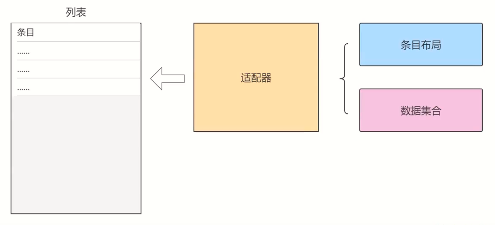
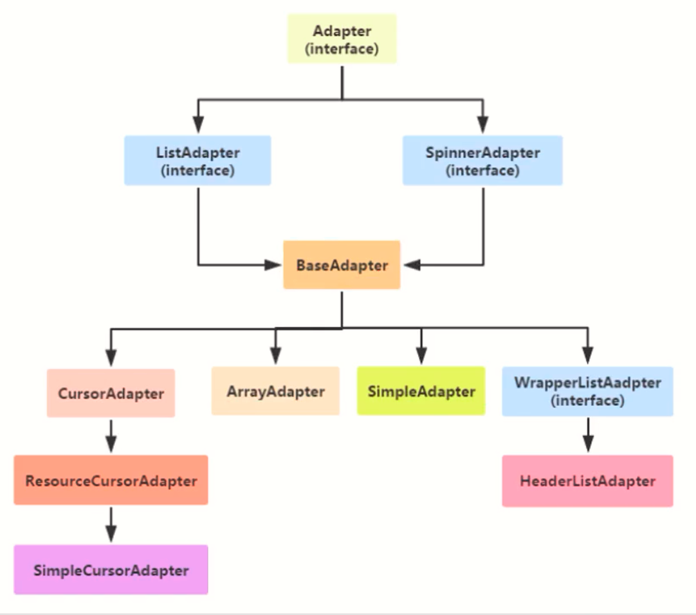

# 下拉列表
- [下拉列表](#下拉列表)
  - [下拉框Spinner](#下拉框spinner)
  - [适配器(Adapter)](#适配器adapter)
    - [数组适配器ArrayAdapter](#数组适配器arrayadapter)
    - [简单适配器SimpleAdapter](#简单适配器simpleadapter)


## 下拉框Spinner

Spinner用于从一串列表中选择某项，功能类似于单选按钮的组合。

Spinner有两种模式：

- 下拉列表 `android:spinnerMode="dropdown"`
- 对话框   `android:spinnerMode="dialog"`

## 适配器(Adapter)

适配器(Adapter)负责从数据集合中取出对应的数据显示到条目布局上。



适配器继承结构



### 数组适配器ArrayAdapter

最简单的适配器，只展示一行文字。

运用数组适配器分成下列步骤：

- 编写列表项的XML文件，内部布局只有一个TextView标签
- 调用ArrayAdapter的构造方法，填入待展现的字符串数组，以及列表项的XML文件(R.layout.item_select)
- 调用下拉框控件的setAdapter方法，传入第二步得到的适配器实例

```java
import android.os.Bundle;
import android.view.View;
import android.widget.AdapterView;
import android.widget.ArrayAdapter;
import android.widget.Spinner;

import androidx.appcompat.app.AppCompatActivity;

import com.yorick.chapter_08.util.ToastUtil;

public class SpinnerDialogActivity extends AppCompatActivity implements AdapterView.OnItemSelectedListener {

    private final static String[] starArray = {"水星", "金星", "地球", "火星", "木星", "土星"};
    private Spinner spDialog;

    @Override
    protected void onCreate(Bundle savedInstanceState) {
        super.onCreate(savedInstanceState);
        setContentView(R.layout.activity_spinner_dialog);
        spDialog = findViewById(R.id.sp_dialog);
        // 声明一个下拉列表的数组适配器
        ArrayAdapter<String> starAdapter = new ArrayAdapter<>(this, R.layout.item_select, starArray);
        spDialog.setPrompt("请选择行星");
        spDialog.setAdapter(starAdapter);
        spDialog.setSelection(0);
        spDialog.setOnItemSelectedListener(this);
    }

    @Override
    public void onItemSelected(AdapterView<?> parent, View view, int position, long id) {
        ToastUtil.show(this, "您选择的是" + starArray[position]);
    }

    @Override
    public void onNothingSelected(AdapterView<?> parent) {

    }
}
```

### 简单适配器SimpleAdapter

```java
public class SpinnerIconActivity extends AppCompatActivity implements AdapterView.OnItemSelectedListener {

    private final static String[] starArray = {"水星", "金星", "地球", "火星", "木星", "土星"};
    // 定义下拉列表需要显示的行星图标数组
    private static final int[] iconArray = {
            R.drawable.shuixing, R.drawable.jinxing, R.drawable.diqiu,
            R.drawable.huoxing, R.drawable.muxing, R.drawable.tuxing
    };

    @Override
    protected void onCreate(Bundle savedInstanceState) {
        super.onCreate(savedInstanceState);
        setContentView(R.layout.activity_spinner_icon);
        List<Map<String, Object>> list = new ArrayList<>();
        for (int i = 0; i < iconArray.length; i++) {
            Map<String, Object> item = new HashMap<>();
            item.put("icon", iconArray[i]);
            item.put("name", starArray[i]);
            list.add(item);
        }
        SimpleAdapter starAdapter = new SimpleAdapter(this, list, R.layout.item_simple,
                new String[]{"icon", "name"},
                new int[]{R.id.iv_icon, R.id.tv_name});
        Spinner spIcon = findViewById(R.id.sp_icon);
        spIcon.setAdapter(starAdapter);
        spIcon.setSelection(0);
        spIcon.setOnItemSelectedListener(this);
    }

    @Override
    public void onItemSelected(AdapterView<?> parent, View view, int position, long id) {
        ToastUtil.show(this, "您选择的是" + starArray[position]);
    }

    @Override
    public void onNothingSelected(AdapterView<?> parent) {

    }
}
```


