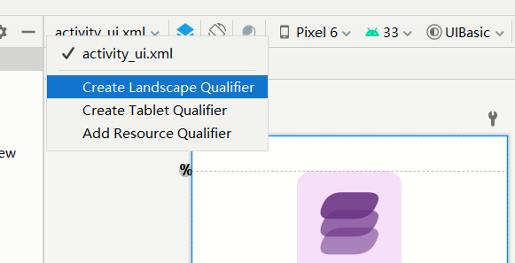

# 屏幕旋转ScreenOrientation

## 性质

1. 对于ConstraintLayout，如果使用绝对布局，旋转可能会导致控件显示异常。
2. 对于相对位置的控件，在大多数情况下还可以正常显示，但是有可能存在异常。
3. 屏幕旋转时，Activity会重新加载。

## 控制旋转

在manifest文件中为Activity添加属性：

- `android:screenOrientation="portrait"` 保持竖屏
- `android:screenOrientation="landscape"` 保持横屏

## 实现横屏竖屏两种布局



在这里新建一个Landscape的副本，可以重新调整控件位置。

##  实现状态保存

实现横竖屏切换时的状态保存

1. 在Activity中重写父类的`onSaveInstanceState`方法，Bundle是一种采用键值对方式存储的数据类型，这里使用它的`putString`方法存放数据。

   ```kotlin
   override fun onSaveInstanceState(outState: Bundle) {
       super.onSaveInstanceState(outState)
       outState.putString("title", textView.text.toString())
   }
   ```

2. 在`onCreate`方法中添加，使用`getString`方法获取数据。

   ```kotlin
   textView.text = savedInstanceState?.getString("title") ?: textView.text
   // savedInstanceState为空则不执行getString方法，?: 前为空则使用后面的内容
   ```

   

这里只能临时保存数据，当Activity被销毁后，数据仍然会丢失。