# 可视化UI设计

[TOC]

## 约束布局ConstraintLayout

约束布局ConstraintLayout是一个使用“相对定位”灵活地确定控件的位置和大小的一个布局，在 2016 年 Google I/O 中面世，它的出现是为了解决开发中过于复杂的页面层级嵌套过多的问题——层级过深会增加绘制界面需要的时间，影响用户体验，以灵活的方式定位和调整小部件。

### 基本位置约束

1. **直接拖动蓝点**。首先认识各个位置的定义，（注意：这里每个词指的不是具体的点，而是该点所在的红色直线！）

   

   下图显示布局约束，➡️代表指向，意思是控件的某个位置相对于其他控件或者布局的位置。例如：控件底部在父布局的底部，但是控件顶部又在父布局的顶部，这是两个约束拉扯，控件最终居中，但是我们仍然可以拖动控件调整位置，这里修改的是控件在两个约束之间的比重，默认是50

   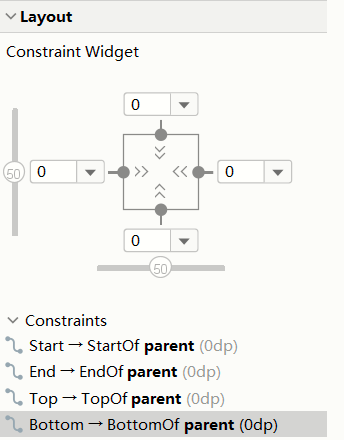

   查看生成的代码

   ```xml
   <TextView
   android:id="@+id/textView2"
   android:layout_width="wrap_content"
   android:layout_height="wrap_content"
   android:text="TextView"
   android:textSize="34sp"
   app:layout_constraintBottom_toBottomOf="parent" // 代表控件底部在父布局的底部
   app:layout_constraintEnd_toEndOf="parent"		// 代表控件结束位置在父控件的结束位置
   app:layout_constraintStart_toStartOf="parent"
   app:layout_constraintTop_toTopOf="parent" />
   ```

   若我们拖动控件，则会增加如下代码：

   ```xml
   app:layout_constraintHorizontal_bias="0.35" // 代表控件在受到水平约束时到两端的比例，范围0~1
   app:layout_constraintVertical_bias="0.65" // 代表控件在受到竖直约束时到两端的比例，范围0~1
   ```

2. **点击魔法棒🪄**，会自动添加约束，同时以外边距的形式添加距离。

   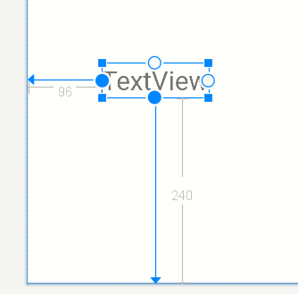

   ```xml
   android:layout_marginStart="96dp"
   android:layout_marginBottom="240dp"
   app:layout_constraintBottom_toBottomOf="parent"
   app:layout_constraintStart_toStartOf="parent" 
   ```

   

### 对多个控件操作

#### Pack

1. 选择多个控件

   

2. 点击`Pack`

   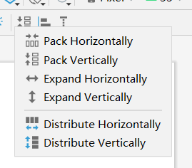

3. Pack Horizontally，会以最Start位置的Start边界为基准水平紧凑对齐

   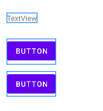

   下面是有阻挡得情况

   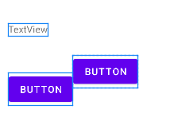

4. Pack Vertically，同理，Buttom

   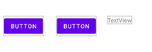

   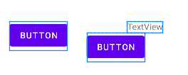

5. Expand Horizontally，水平拉伸

   

6. Expand Vertically，竖直拉伸

   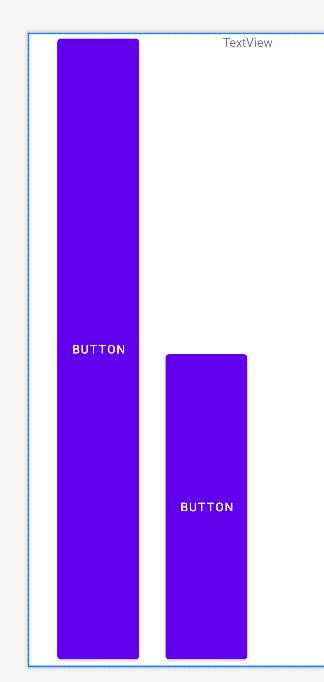

7. Distribute Horizontally，添加水平方向相互约束

   

8. Distribute Vertically，添加竖直方向相互约束

   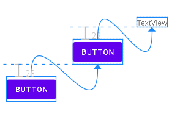

   

所有操作都会通过修改控件绝对位置来改变位置，坐标原点在Start与Top交点处。

```xml
tools:layout_editor_absoluteX="123dp" // 绝对x轴位置
tools:layout_editor_absoluteY="456dp" // 绝对Y轴位置
```

Expend操作会修改控件大小

```xml
android:layout_width="400dp"
android:layout_height="200dp"
```

Distribute操作会添加约束，如：

```xml
app:layout_constraintStart_toEndOf="@+id/button4"
```

#### Align

多选后点击Align，直接看图标就能理解作用。

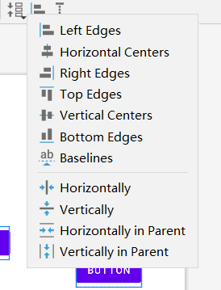

注意点：

1. 与Pack不同，这里的对齐是是通过添加约束实现，而且控件可能重叠。

   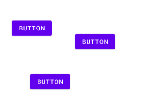

2. Baselines是文字基线对齐，选中控件，右键菜单选择显示

   
   
   然后拖到想要约束的位置，一般是另一个控件的基线
   
      

#### 清除控件所有约束

所有约束都会被清除

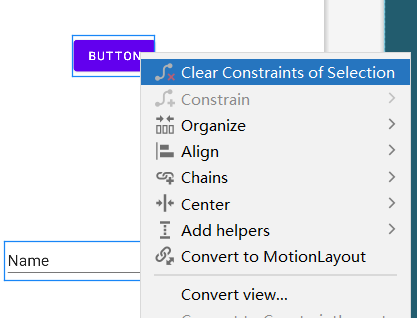