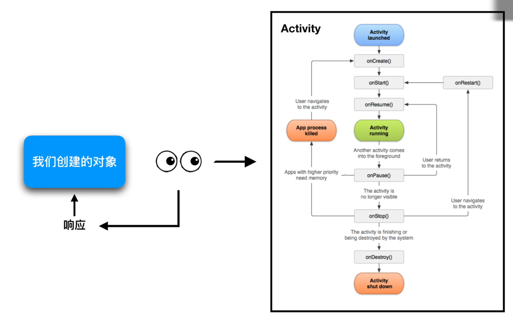

# LifeCycles

[使用生命周期感知型组件处理生命周期  | Android 开发者  | Android Developers (google.cn)](https://developer.android.google.cn/topic/libraries/architecture/lifecycle)



## 示例：

1. 创建项目`LifeCycles`

2. 创建布局文件

   ```xml
   <androidx.constraintlayout.widget.ConstraintLayout xmlns:android="http://schemas.android.com/apk/res/android"
       xmlns:app="http://schemas.android.com/apk/res-auto"
       xmlns:tools="http://schemas.android.com/tools"
       android:layout_width="match_parent"
       android:layout_height="match_parent"
       tools:context=".MainActivity">
   
       <Chronometer
           android:id="@+id/meter"
           android:layout_width="wrap_content"
           android:layout_height="wrap_content"
           android:textSize="34sp"
           app:layout_constraintBottom_toBottomOf="parent"
           app:layout_constraintEnd_toEndOf="parent"
           app:layout_constraintStart_toStartOf="parent"
           app:layout_constraintTop_toTopOf="parent" />
   </androidx.constraintlayout.widget.ConstraintLayout>
   ```

3. `MainActivity`中

   ```kotlin
   class MainActivity : AppCompatActivity() {
       lateinit var chronometer: Chronometer
       override fun onCreate(savedInstanceState: Bundle?) {
           super.onCreate(savedInstanceState)
           setContentView(R.layout.activity_main)
           chronometer = findViewById(R.id.meter)
   //        chronometer.base = System.currentTimeMillis() // UNIX 时间 1970 1 1 0时（格林尼治）至今的毫秒数
           chronometer.base = SystemClock.elapsedRealtime() // 手机上次开机至今的毫秒数，这里就是默认值，不写也行
           chronometer.start()
       }
   }
   ```

   运行App，打开后计时器开始计时，放在后台依然继续计时。

4. 继承`onPause`方法，添加`chronometer.stop()`

   ```kotlin
   override fun onPause() {
       super.onPause()
       chronometer.stop()
   }
   ```

   发现切到后台后计时器停止，再次返回前台依然停止。

5. 继承`onResume`方法，添加`chronometer.start()`，同时删除`onCreate`方法中的`chronometer.start()`

   ```kotlin
   override fun onResume() {
       super.onResume()
       chronometer.start()
   }
   ```

   发现打开后计时器开始计时，切回后台重新打开依然继续计时。

   实际上`chronometer.start()`和`chronometer.stop()`方法仅仅改变的是视图中计时器的启动与停止，并不回真正控制其计时。

6. 添加变量elapsedTime，并修改`onPause`方法和`onResume`方法

   ```kotlin
   private var elapsedTime: Long = 0 // 保存切回后台前的计时器时间
   override fun onPause() {
       super.onPause()
       elapsedTime = SystemClock.elapsedRealtime() - chronometer.base
       chronometer.stop() // 可写可不写
   }
   override fun onResume() {
       super.onResume()
       chronometer.base = SystemClock.elapsedRealtime() - elapsedTime // 将计时器的开始计时点设为当前时间减去保存的切回后台前的计时器时间
       chronometer.start()
   }
   ```

   如果有很多像`elapsedTime`这样需要在生命周期方法里管理的对象，这样写其实就存在很多问题。

   - 代码繁杂臃肿，界面控制器Activity和Fragment应该尽可能保持精简。
   - 代码可复用性差

7. 自定义View，新建`MyChronometer`类，继承`Chronometer`类，实现`DefaultLifecycleObserver`接口

   ```kotlin
   class MyChronometer(
       context: Context,
       attributeSet: AttributeSet
   ) : Chronometer(context, attributeSet), DefaultLifecycleObserver {
       private var elapsedTime: Long = 0
       override fun onPause(owner: LifecycleOwner) {
           elapsedTime = SystemClock.elapsedRealtime() - base
           stop()
       }
   
       override fun onResume(owner: LifecycleOwner) {
           base = SystemClock.elapsedRealtime() - elapsedTime
           start()
       }
   }
   ```

8. `MainActivity`精简为

   ```kotlin
   class MainActivity : AppCompatActivity() {
       lateinit var chronometer: MyChronometer
       override fun onCreate(savedInstanceState: Bundle?) {
           super.onCreate(savedInstanceState)
           setContentView(R.layout.activity_main)
           chronometer = findViewById(R.id.meter)
           lifecycle.addObserver(chronometer) // 注册生命周期观察者
       }
   }
   ```

   修改`Chronometer`控件的标签为`com.yorick.lifecycles.MyChronometer`

   运行，实现了上面一样的效果，但是`MainActivity`非常精简，没有多余的代码。

