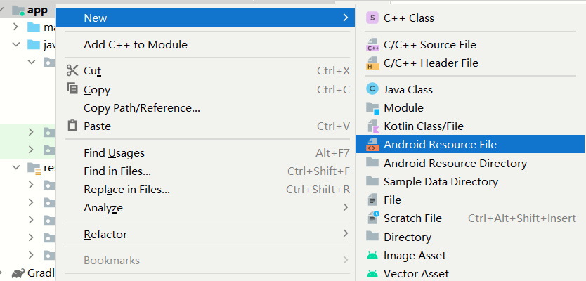
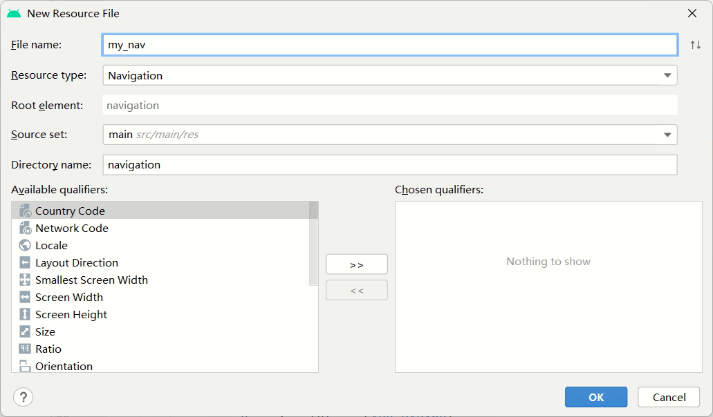
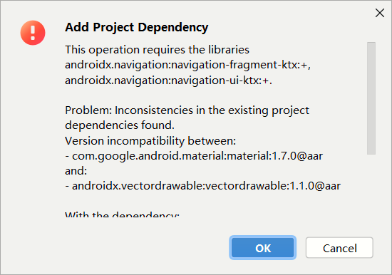
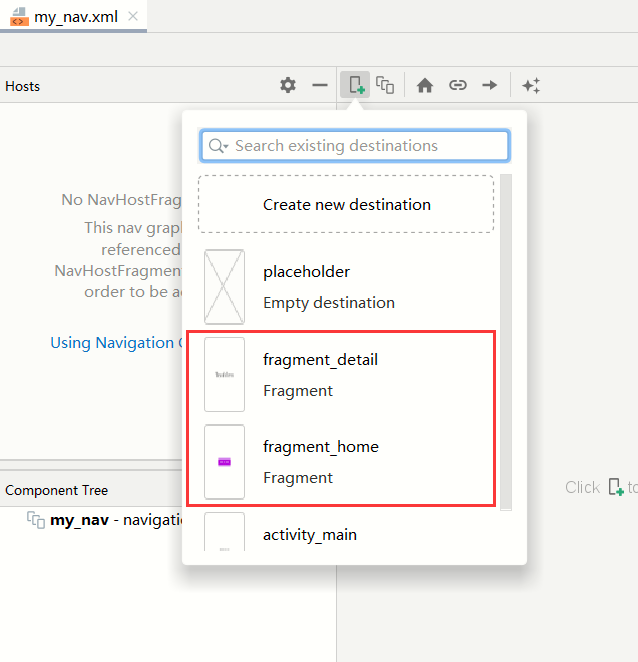
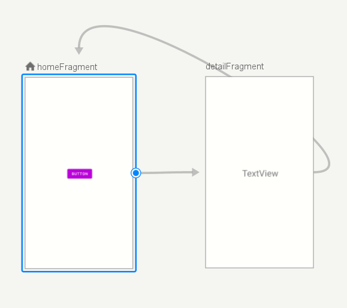
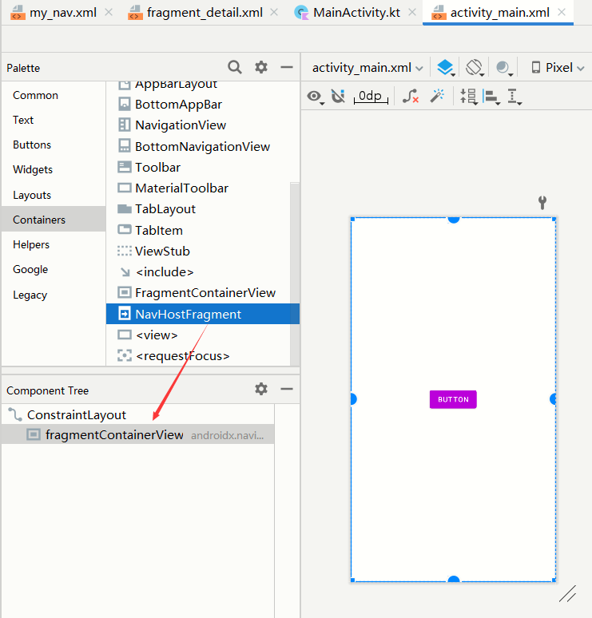
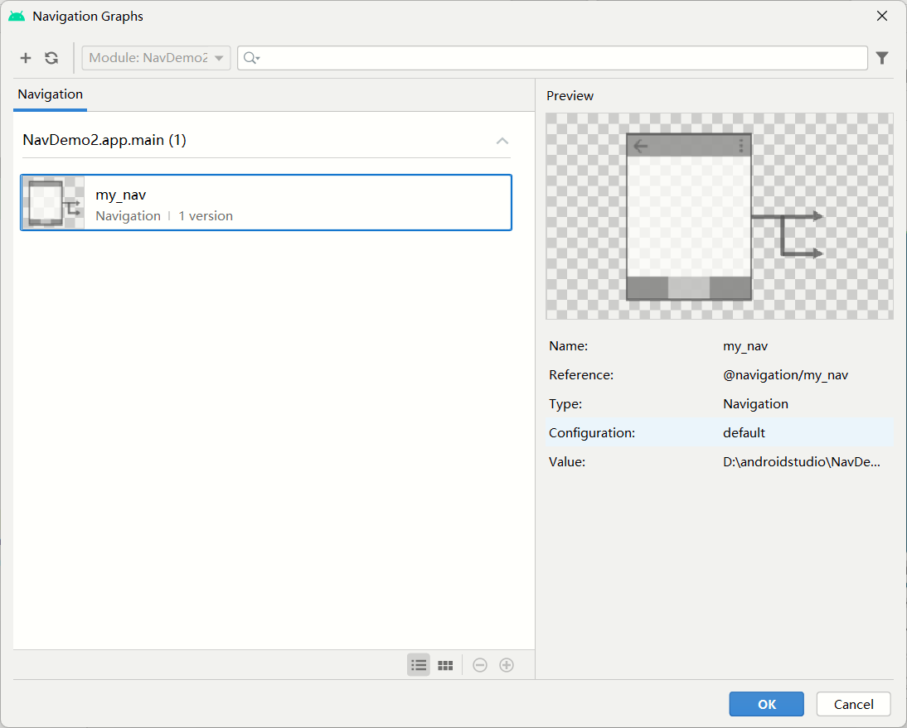
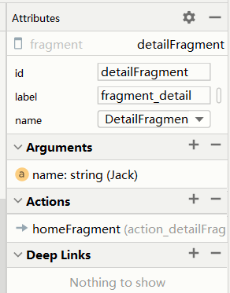
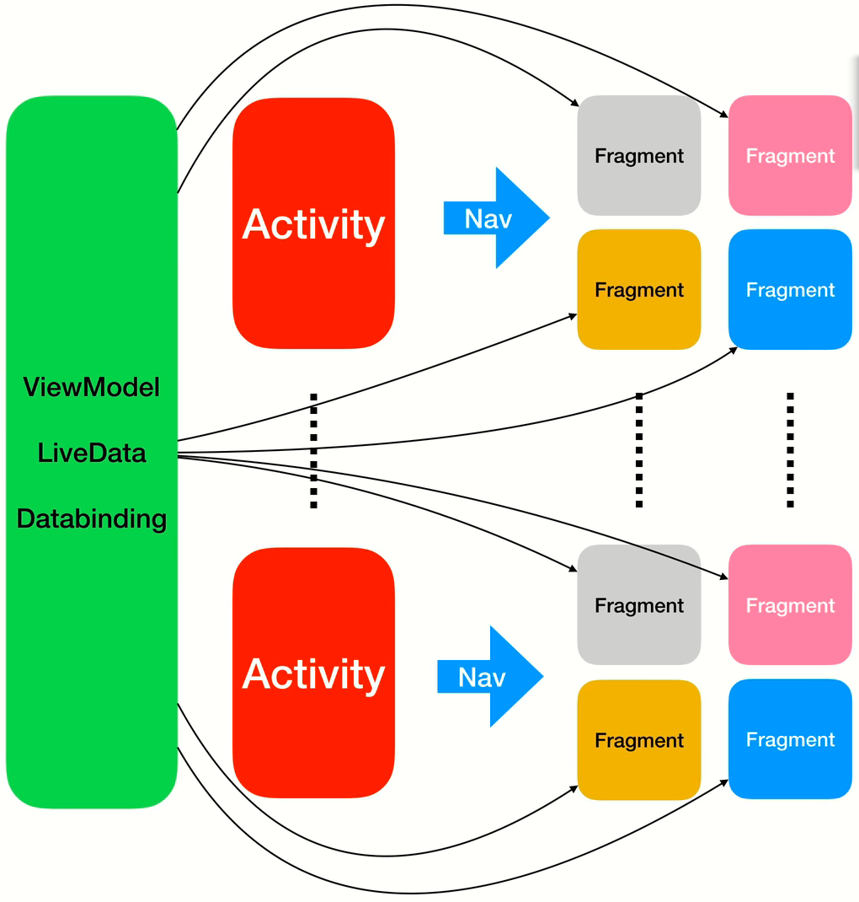

# Navigation

[TOC]

[Navigation 组件使用入门  | Android 开发者  | Android Developers (google.cn)](https://developer.android.google.cn/guide/navigation/navigation-getting-started?hl=zh-cn)

[使用 NavigationUI 更新界面组件  | Android 开发者  | Android Developers (google.cn)](https://developer.android.google.cn/guide/navigation/navigation-ui?hl=zh-cn#kotlin)

[Navigation的用法-CSDN博客](https://blog.csdn.net/qq_33235287/article/details/104512251)

## Navigation介绍


导航是指支持用户导航、进入和退出应用中不同内容片段的交互。Android Jetpack 的导航组件可帮助您实现导航，无论是简单的按钮点击，还是应用栏和抽屉式导航栏等更为复杂的模式，该组件均可应对。导航组件还通过遵循[一套既定原则](https://developer.android.google.cn/guide/navigation/navigation-principles?hl=zh-cn)来确保一致且可预测的用户体验。

导航组件由以下三个关键部分组成：

- 导航图：在一个集中位置包含所有导航相关信息的 XML 资源。这包括应用内所有单个内容区域（称为*目标*）以及用户可以通过应用获取的可能路径。
- `NavHost`：显示导航图中目标的空白容器。导航组件包含一个默认 `NavHost` 实现 ([`NavHostFragment`](https://developer.android.google.cn/reference/androidx/navigation/fragment/NavHostFragment?hl=zh-cn))，可显示 Fragment 目标。
- `NavController`：在 `NavHost` 中管理应用导航的对象。当用户在整个应用中移动时，`NavController` 会安排 `NavHost` 中目标内容的交换。

在应用中导航时，您告诉 `NavController`，您想沿导航图中的特定路径导航至特定目标，或直接导航至特定目标。`NavController` 便会在 `NavHost` 中显示相应目标。

导航组件提供各种其他优势，包括以下内容：

- 处理 Fragment 事务。
- 默认情况下，正确处理往返操作。
- 为动画和转换提供标准化资源。
- 实现和处理深层链接。
- 包括导航界面模式（例如抽屉式导航栏和底部导航），用户只需完成极少的额外工作。
- [Safe Args](https://developer.android.google.cn/guide/navigation/navigation-pass-data?hl=zh-cn#Safe-args) - 可在目标之间导航和传递数据时提供类型安全的 Gradle 插件。
- `ViewModel` 支持 - 您可以将 `ViewModel` 的范围限定为导航图，以在图表的目标之间共享与界面相关的数据。

此外，您还可以使用 Android Studio 的 [Navigation Editor](https://developer.android.google.cn/guide/navigation/navigation-getting-started?hl=zh-cn) 来查看和编辑导航图。

## 配置环境

如需在您的项目中添加 Navigation 支持，请向应用的 `build.gradle` 文件添加以下依赖项：

```groovy
dependencies {
  def nav_version = "2.5.3"

  // Java language implementation
  implementation "androidx.navigation:navigation-fragment:$nav_version"
  implementation "androidx.navigation:navigation-ui:$nav_version"

  // Kotlin
  implementation "androidx.navigation:navigation-fragment-ktx:$nav_version"
  implementation "androidx.navigation:navigation-ui-ktx:$nav_version"

  // Feature module Support
  implementation "androidx.navigation:navigation-dynamic-features-fragment:$nav_version"

  // Testing Navigation
  androidTestImplementation "androidx.navigation:navigation-testing:$nav_version"

  // Jetpack Compose Integration
  implementation "androidx.navigation:navigation-compose:$nav_version"
}
```

## 创建导航图

导航发生在应用中的各个目的地（即您的应用中用户可以导航到的任意位置）之间。这些目的地是通过操作连接的。

导航图是一种资源文件，其中包含您的所有目的地和操作。该图表会显示应用的所有导航路径。

图 1 直观显示了一个示例应用的导航图，该应用包含 6 个目的地（通过 5 个操作连接）。每个目的地均由一个预览缩略图表示，连接操作由箭头表示，该箭头表示用户可以如何从一个目的地导航到另一个目的地。

**图 1.** 一个导航图，显示了由 5 个操作连接的 6 个不同目的地的预览。

1. “目的地”是指应用中的不同内容区域。
2. “操作”是指目的地之间的逻辑连接，表示用户可以采取的路径。

如需向项目添加导航图，请执行以下操作：

1. 在“Project”窗口中，右键点击 `res` 目录，然后依次选择 **New > Android Resource File**。此时系统会显示 **New Resource File** 对话框。
2. 在 **File name** 字段中输入名称，例如“nav_graph”。
3. 从 **Resource type** 下拉列表中选择 **Navigation**，然后点击 **OK**。

当您添加首个导航图时，Android Studio 会在 `res` 目录内创建一个 `navigation` 资源目录。该目录包含您的导航图资源文件（例如 `nav_graph.xml`）。

**注意**：向您的项目添加导航图时，如果您尚未将导航依赖项添加到应用的 `build.gradle` 文件中，Android Studio 会显示一条提示，并为您提供添加依赖项的选项。但请注意，Android Studio 3.4 添加了非 KTX 1.0.0 版本的依赖项，因此，如果您使用的是 Kotlin 或打算使用 2.0.0 或更高版本，请务必替换这些值。

## Navigation Editor

添加图表后，Android Studio 会在 Navigation Editor 中打开该图表。在 Navigation Editor 中，您可以直观地修改导航图，或直接修改底层 XML。

**图 2.** Navigation Editor

1. **Destinations panel**：列出了导航宿主和目前位于 **Graph Editor** 中的所有目的地。
2. **Graph Editor**：包含导航图的视觉表示形式。您可以在 **Design** 视图和 **Text** 视图中的底层 XML 表示形式之间切换。
3. **Attributes**：显示导航图中当前所选项的属性。

点击 **Text** 标签页可查看相应的 XML，它应类似于以下代码段：

```xml
<?xml version="1.0" encoding="utf-8"?>
<navigation xmlns:android="http://schemas.android.com/apk/res/android"
            xmlns:app="http://schemas.android.com/apk/res-auto"
            android:id="@+id/nav_graph">

</navigation>
```

`<navigation>` 元素是导航图的根元素。当您向图表添加目的地和连接操作时，可以看到相应的 `<destination>` 和 `<action>` 元素在此处显示为子元素。如果您有[嵌套图表](https://developer.android.google.cn/guide/navigation/navigation-nested-graphs?hl=zh-cn)，它们将显示为子 `<navigation>` 元素。

## 向 Activity 添加 NavHost

导航宿主是 Navigation 组件的核心部分之一。导航宿主是一个空容器，用户在您的应用中导航时，目的地会在该容器中交换进出。

导航宿主必须派生于 [`NavHost`](https://developer.android.google.cn/reference/androidx/navigation/NavHost?hl=zh-cn)。Navigation 组件的默认 `NavHost` 实现 ([`NavHostFragment`](https://developer.android.google.cn/reference/androidx/navigation/fragment/NavHostFragment?hl=zh-cn)) 负责处理 Fragment 目的地的交换。

**注意**：Navigation 组件旨在用于具有一个主 activity 和多个 fragment 目的地的应用。主 activity 与导航图相关联，且包含一个负责根据需要交换目的地的 `NavHostFragment`。在具有多个 activity 目的地的应用中，每个 activity 均拥有其自己的导航图。

### 通过 XML 添加 NavHostFragment

以下 XML 示例显示了作为应用主 Activity 一部分的 `NavHostFragment`：

```xml
<?xml version="1.0" encoding="utf-8"?>
<androidx.constraintlayout.widget.ConstraintLayout
    xmlns:android="http://schemas.android.com/apk/res/android"
    xmlns:app="http://schemas.android.com/apk/res-auto"
    xmlns:tools="http://schemas.android.com/tools"
    android:layout_width="match_parent"
    android:layout_height="match_parent"
    tools:context=".MainActivity">

    <androidx.appcompat.widget.Toolbar
        .../>

    <androidx.fragment.app.FragmentContainerView
        android:id="@+id/nav_host_fragment"
        android:name="androidx.navigation.fragment.NavHostFragment"
        android:layout_width="0dp"
        android:layout_height="0dp"
        app:layout_constraintLeft_toLeftOf="parent"
        app:layout_constraintRight_toRightOf="parent"
        app:layout_constraintTop_toTopOf="parent"
        app:layout_constraintBottom_toBottomOf="parent"

        app:defaultNavHost="true"
        app:navGraph="@navigation/nav_graph" />

    <com.google.android.material.bottomnavigation.BottomNavigationView
        .../>

</androidx.constraintlayout.widget.ConstraintLayout>
```

请注意以下几点：

- `android:name` 属性包含 `NavHost` 实现的类名称。
- `app:navGraph` 属性将 `NavHostFragment` 与导航图相关联。导航图会在此 `NavHostFragment` 中指定用户可以导航到的所有目的地。
- `app:defaultNavHost="true"` 属性确保您的 `NavHostFragment` 会拦截系统返回按钮。请注意，只能有一个默认 `NavHost`。如果同一布局（例如，双窗格布局）中有多个托管容器，请务必仅指定一个默认 `NavHost`。

您也可以使用[布局编辑器](https://developer.android.google.cn/studio/write/layout-editor?hl=zh-cn)向 activity 添加 `NavHostFragment`，具体操作步骤如下：

1. 在项目文件列表中，双击 Activity 的布局 XML 文件，以在 Layout Editor 中将其打开。
2. 在 **Palette** 窗格内，选择 **Containers** 类别，或者搜索“NavHostFragment”。
3. 将 `NavHostFragment` 视图拖动到您的 Activity 上。
4. 接下来，在随即显示的 **Navigation Graphs** 对话框中，选择需要与此 `NavHostFragment` 相关联的相应导航图，然后点击 **OK**。

## 向导航图添加目的地

您可以从现有的 Fragment 或 Activity 创建目的地。您还可以使用 Navigation Editor 创建新目的地，或创建占位符以便稍后替换为 fragment 或 activity。

在本示例中，我们来创建一个新目的地。如需使用 Navigation Editor 添加新目的地，请执行以下操作：

1. 在 Navigation Editor 中，点击 **New Destination** 图标 ，然后点击 **Create new destination**。
2. 在随即显示的 **New Android Component** 对话框中，创建您的 Fragment。如需详细了解 Fragment，请参阅 [Fragment 文档](https://developer.android.google.cn/guide/components/fragments?hl=zh-cn)。

当您返回到 Navigation Editor 中时，会发现 Android Studio 已将此目的地添加到图中。

图 1 显示了目的地和[占位符目的地](https://developer.android.google.cn/guide/navigation/navigation-create-destinations?hl=zh-cn#placeholders)的示例。

**图 3.** 目的地和占位符

如需了解向导航图添加目的地的其他方式，请参阅[创建目的地](https://developer.android.google.cn/guide/navigation/navigation-create-destinations?hl=zh-cn)。

## 目的地详解

点击一个目的地以将其选中，并注意 **Attributes** 面板中显示的以下属性：

- **Type** 字段指示在您的源代码中，该目的地是作为 fragment、activity 还是其他自定义类实现的。
- **Label** 字段包含该目的地的用户可读名称。例如，如果您使用 [`setupWithNavController()`](https://developer.android.google.cn/reference/androidx/navigation/ui/NavigationUI?hl=zh-cn#setupWithNavController(androidx.appcompat.widget.Toolbar, androidx.navigation.NavController)) 将 [`NavGraph`](https://developer.android.google.cn/reference/androidx/navigation/NavGraph?hl=zh-cn) 连接到 `Toolbar`，就可能在界面上看到此字段。因此，我们建议您对此值使用资源字符串。
- **ID** 字段包含该目的地的 ID，它用于在代码中引用该目的地。
- **Class** 下拉列表显示与该目的地相关联的类的名称。您可以点击此下拉列表，将相关联的类更改为其他目的地类型。

点击 **Text** 标签页可查看导航图的 XML 视图。XML 中同样包含该目的地的 `id`、`name`、`label` 和 `layout` 属性，如下所示：

```xml
<?xml version="1.0" encoding="utf-8"?>
<navigation xmlns:app="http://schemas.android.com/apk/res-auto"
    xmlns:tools="http://schemas.android.com/tools"
    xmlns:android="http://schemas.android.com/apk/res/android"
    app:startDestination="@id/blankFragment">
    <fragment
        android:id="@+id/blankFragment"
        android:name="com.example.cashdog.cashdog.BlankFragment"
        android:label="@string/label_blank"
        tools:layout="@layout/fragment_blank" />
</navigation>
```

## 将某个屏幕指定为起始目的地

[起始目的地](https://developer.android.google.cn/guide/navigation/navigation-principles?hl=zh-cn)是用户打开您的应用时看到的第一个屏幕，也是用户退出您的应用时看到的最后一个屏幕。Navigation Editor 使用房子图标  表示起始目的地。

所有目的地就绪后，您便可以选择起始目的地，具体操作步骤如下：

1. 在 **Design** 标签页中，点击相应目的地，使其突出显示。
2. 点击 **Assign start destination** 按钮 。或者，您可以右键点击该目的地，然后点击 **Set as Start Destination**。

## 连接目的地

操作是指目的地之间的逻辑连接。操作在导航图中以箭头表示。操作通常会将一个目的地连接到另一个目的地，不过您也可以创建[全局操作](https://developer.android.google.cn/guide/navigation/navigation-global-action?hl=zh-cn)，此类操作可让您从应用中的任意位置转到特定目的地。

借助操作，您可以表示用户在您的应用中导航时可以采取的不同路径。请注意，如需实际导航到各个目的地，您仍然需要编写代码以执行导航操作。如需了解详情，请参阅本主题后面的[导航到目的地](https://developer.android.google.cn/guide/navigation/navigation-getting-started?hl=zh-cn#navigate)部分。

您可以使用 Navigation Editor 将两个目的地连接起来，具体操作步骤如下：

1. 在 **Design** 标签页中，将鼠标悬停在目的地的右侧，该目的地为您希望用户从中导航出来的目的地。该目的地右侧上方会显示一个圆圈，如图 4 所示。

   
   **图 4.** 一个包含操作连接圆圈的目的地

2. 点击您希望用户导航到的目的地，并将光标拖动到该目的地的上方，然后松开。这两个目的地之间生成的线条表示操作，如图 5 所示。

   **图 5.** 通过操作连接目的地

3. 点击箭头以突出显示该操作。此时 **Attributes** 面板中会显示以下属性：

   - **Type** 字段包含“Action”。
   - **ID** 字段包含该操作的 ID。
   - **Destination** 字段包含目的地 Fragment 或 Activity 的 ID。

4. 点击 **Text** 标签，以切换到 XML 视图。现在，一个 action 元素已添加到源目的地中。该操作有一个 ID 和一个目的地属性（其中包含下一个目的地的 ID），如以下示例所示：

   ```xml
   <?xml version="1.0" encoding="utf-8"?>
   <navigation xmlns:app="http://schemas.android.com/apk/res-auto"
       xmlns:tools="http://schemas.android.com/tools"
       xmlns:android="http://schemas.android.com/apk/res/android"
       app:startDestination="@id/blankFragment">
       <fragment
           android:id="@+id/blankFragment"
           android:name="com.example.cashdog.cashdog.BlankFragment"
           android:label="@string/label_blank"
           tools:layout="@layout/fragment_blank" >
           <action
               android:id="@+id/action_blankFragment_to_blankFragment2"
               app:destination="@id/blankFragment2" />
       </fragment>
       <fragment
           android:id="@+id/blankFragment2"
           android:name="com.example.cashdog.cashdog.BlankFragment2"
           android:label="@string/label_blank_2"
           tools:layout="@layout/fragment_blank_fragment2" />
   </navigation>
   ```

在导航图中，操作由 `<action>` 元素表示。操作至少应包含自己的 ID 和用户应转到的目的地的 ID。

## 导航到目的地

导航到目的地是使用 [`NavController`](https://developer.android.google.cn/reference/androidx/navigation/NavController?hl=zh-cn) 完成的，它是一个在 `NavHost` 中管理应用导航的对象。每个 `NavHost` 均有自己的相应 `NavController`。您可以使用以下方法之一检索 `NavController`：

**Kotlin**：

- [`Fragment.findNavController()`](https://developer.android.google.cn/reference/kotlin/androidx/navigation/fragment/package-summary?hl=zh-cn#(androidx.fragment.app.Fragment).findNavController())
- [`View.findNavController()`](https://developer.android.google.cn/reference/kotlin/androidx/navigation/package-summary?hl=zh-cn#(android.view.View).findNavController())
- [`Activity.findNavController(viewId: Int)`](https://developer.android.google.cn/reference/kotlin/androidx/navigation/package-summary?hl=zh-cn#(android.app.Activity).findNavController(kotlin.Int))

**Java**：

- [`NavHostFragment.findNavController(Fragment)`](https://developer.android.google.cn/reference/androidx/navigation/fragment/NavHostFragment?hl=zh-cn#findNavController(android.support.v4.app.Fragment))
- [`Navigation.findNavController(Activity, @IdRes int viewId)`](https://developer.android.google.cn/reference/androidx/navigation/Navigation?hl=zh-cn#findNavController(android.app.Activity, int))
- [`Navigation.findNavController(View)`](https://developer.android.google.cn/reference/androidx/navigation/Navigation?hl=zh-cn#findNavController(android.view.View))

使用 `FragmentContainerView` 创建 `NavHostFragment`，或通过 `FragmentTransaction` 手动将 `NavHostFragment` 添加到您的 Activity 时，尝试通过 `Navigation.findNavController(Activity, @IdRes int)` 检索 Activity 的 `onCreate()` 中的 `NavController` 将失败。您应改为直接从 `NavHostFragment` 检索 `NavController`。

[Kotlin](https://developer.android.google.cn/guide/navigation/navigation-getting-started?hl=zh-cn#kotlin)[Java](https://developer.android.google.cn/guide/navigation/navigation-getting-started?hl=zh-cn#java)

```kotlin
val navHostFragment =
        supportFragmentManager.findFragmentById(R.id.nav_host_fragment) as NavHostFragment
val navController = navHostFragment.navController
```

### 使用 Safe Args 确保类型安全

如需在目的地之间导航，建议使用 Safe Args Gradle 插件。该插件可以生成简单的对象和构建器类，这些类支持在目的地之间进行类型安全的导航和参数传递。

**注意**：如需了解其他导航方式，请参阅[导航到目的地](https://developer.android.google.cn/guide/navigation/navigation-navigate?hl=zh-cn)。

如需将 [Safe Args](https://developer.android.google.cn/topic/libraries/architecture/navigation/navigation-pass-data?hl=zh-cn#Safe-args) 添加到您的项目，请在顶层 `build.gradle` 文件中包含以下 `classpath`：

[Groovy](https://developer.android.google.cn/guide/navigation/navigation-getting-started?hl=zh-cn#groovy)[Kotlin](https://developer.android.google.cn/guide/navigation/navigation-getting-started?hl=zh-cn#kotlin)

```groovy
buildscript {
    repositories {
        google()
    }
    dependencies {
        def nav_version = "2.5.3"
        classpath "androidx.navigation:navigation-safe-args-gradle-plugin:$nav_version"
    }
}
```

您还必须应用以下两个可用插件之一。

如需生成适用于 Java 模块或 Java 和 Kotlin 混合模块的 Java 语言代码，请将以下行添加到**应用或模块**的 `build.gradle` 文件中：

[Groovy](https://developer.android.google.cn/guide/navigation/navigation-getting-started?hl=zh-cn#groovy)[Kotlin](https://developer.android.google.cn/guide/navigation/navigation-getting-started?hl=zh-cn#kotlin)

```groovy
plugins {
  id 'androidx.navigation.safeargs'
}
```

此外，如需生成仅适用于 Kotlin 模块的 Kotlin 语言代码，请添加以下行：

[Groovy](https://developer.android.google.cn/guide/navigation/navigation-getting-started?hl=zh-cn#groovy)[Kotlin](https://developer.android.google.cn/guide/navigation/navigation-getting-started?hl=zh-cn#kotlin)

```groovy
plugins {
  id 'androidx.navigation.safeargs.kotlin'
}
```

根据[迁移到 AndroidX](https://developer.android.google.cn/jetpack/androidx/migrate?hl=zh-cn#migrate)) 文档，您的 [`gradle.properties` 文件](https://developer.android.google.cn/studio/build?hl=zh-cn#properties-files)中必须具有 `android.useAndroidX=true`。

启用 Safe Args 后，该插件会生成代码，其中包含您定义的每个操作的类和方法。对于每个操作，Safe Args 还会为每个源目的地（生成相应操作的目的地）生成一个类。生成的类的名称由源目的地类的名称和“Directions”一词组成。例如，如果目的地的名称为 `SpecifyAmountFragment`，生成的类的名称为 `SpecifyAmountFragmentDirections`。生成的类为源目的地中定义的每个操作提供了一个静态方法。该方法会将任何定义的操作参数作为参数，并返回可传递到 `navigate()` 的 `NavDirections` 对象。

例如，假设我们的导航图包含一个操作，该操作将源目的地 `SpecifyAmountFragment` 和接收目的地 `ConfirmationFragment` 连接起来。

Safe Args 会生成一个 `SpecifyAmountFragmentDirections` 类，其中只包含一个 `actionSpecifyAmountFragmentToConfirmationFragment()` 方法（该方法会返回 `NavDirections` 对象）。然后，您可以将返回的 `NavDirections` 对象直接传递到 `navigate()`，如以下示例所示：

[Kotlin](https://developer.android.google.cn/guide/navigation/navigation-getting-started?hl=zh-cn#kotlin)[Java](https://developer.android.google.cn/guide/navigation/navigation-getting-started?hl=zh-cn#java)

```kotlin
override fun onClick(view: View) {
    val action =
        SpecifyAmountFragmentDirections
            .actionSpecifyAmountFragmentToConfirmationFragment()
    view.findNavController().navigate(action)
}
```

如需详细了解如何使用 Safe Args 在目的地之间传递数据，请参阅[使用 Safe Args 传递类型安全的数据](https://developer.android.google.cn/guide/navigation/navigation-pass-data?hl=zh-cn#Safe-args)。

## 具体使用

### 创建Navigation

1. **新建Fragment**，并创建对应的布局文件

   

   默认的布局是`FrameLayout`，我们可以改为或者嵌套`ConstraintLayout`

   ```xml
   <?xml version="1.0" encoding="utf-8"?>
   <androidx.constraintlayout.widget.ConstraintLayout xmlns:android="http://schemas.android.com/apk/res/android"
       xmlns:tools="http://schemas.android.com/tools"
       android:layout_width="match_parent"
       android:layout_height="match_parent"
       tools:context=".HomeFragment" />
   ```

2. **创建Navigation资源文件**

   

   配置如下

   

   这里AndroidStudio有个小Bug，可能会一直加载布局文件，别慌，我们关掉所有的xml文件，重新打开`my_nav.xml`文件，不出意外会提示缺少依赖：

   

   点击`OK`会自动补全依赖。

   打开`build.gradle`发现自动导入的依赖如下：

   ```groovy
   implementation 'androidx.navigation:navigation-fragment-ktx:2.5.3'
   implementation 'androidx.navigation:navigation-ui-ktx:2.5.3'
   ```

3. **设计跳转逻辑**

   进入Navigation Editor，添加目的地

   

   根据跳转逻辑连接目的地，带房子图标的是**主页**，就是NavHost显示的首个界面

   

4. **向 Activity 添加 NavHost**

   找到`fragmentContainerView`拖到布局中（一定是布局的导航栏中），并添加约束

   

   选择刚刚创建好的Navigation布局文件

   

5. **为控件绑定跳转事件**

   实现`onViewCreated()`方法

   ```kotlin
   override fun onViewCreated(view: View, savedInstanceState: Bundle?) {
       super.onViewCreated(view, savedInstanceState)
       view.findViewById<Button>(R.id.button)
           .setOnClickListener { v ->
               val controller = Navigation.findNavController(v)
               controller.navigate(R.id.action_homeFragment_to_detailFragment)
           }
   }
   ```

   或者

   ```kotlin
   override fun onViewCreated(view: View, savedInstanceState: Bundle?) {
       super.onViewCreated(view, savedInstanceState)
       view.findViewById<Button>(R.id.button)
               .setOnClickListener(Navigation.createNavigateOnClickListener(R.id.action_homeFragment_to_detailFragment))
   }
   ```

### 参数传递

   - **第一种：可视化**
   
     在Navigation Edit中添加参数，在Attributes栏的Argument中，也是以键值对的形式添加。
   
     
   
     添加后fragment标签内增加
     
     ```xml
      <argument
         android:name="name"
       app:argType="string"
         android:defaultValue="Jack" />
   ```
     
     在fragment中通过键值获取参数
     
     ```kotlin
   val string = arguments?.getString("name")
   ```

   可以点击action对改值进行重写，会覆盖掉原来的值。

   注意跳转时目的地不同，携带的参数也不同

   ```kotlin
   controller.navigate(R.id.action_homeFragment_to_detailFragment) // Tom
   controller.navigate(R.id.detailFragment) // Jack
   ```

   - **第二种：通过Bundle传递参数**
   
     ```kotlin
     bundle.putString("my_name", text)
     val controller = Navigation.findNavController(v)
     controller.navigate(R.id.action_homeFragment_to_detailFragment, bundle) // Tom
     ```
   
     接收参数，和上面一样
   
     ```kotlin
     val string1 = arguments?.getString("my_name")
     ```

### 添加动画

1. 创建anim资源文件，类似导航资源文件的创建

2. 创建动画效果，

   示例：从中间向右平移`slide_to_right`

   ```xml
   <?xml version="1.0" encoding="utf-8"?>
   <set xmlns:android="http://schemas.android.com/apk/res/android">
       <translate
           android:duration="300" 	动画时间
           android:fromXDelta="0" 	x轴起点
           android:toXDelta="100%">x轴终点
   
       </translate>
   </set>
   ```

   示例：从左向中间平移`slide_from_left`

   ```xml
   <?xml version="1.0" encoding="utf-8"?>
   <set xmlns:android="http://schemas.android.com/apk/res/android">
       <translate
           android:duration="300"
           android:fromXDelta="-100%"
           android:toXDelta="0%">
   
       </translate>
   </set>
   ```

   示例：简单缩放和旋转，从中间放大

   ```xml
   <?xml version="1.0" encoding="utf-8"?>
   <set xmlns:android="http://schemas.android.com/apk/res/android">
       <scale
           android:duration="1000"  动画时间
           android:fromXScale="0.0" 原比例
           android:fromYScale="0.0"
           android:pivotX="50%"  x轴原点
           android:pivotY="50%"  y轴原点
           android:toXScale="1.0"  放大后比例
           android:toYScale="1.0" />
       <rotate
           android:duration="1000"
           android:fromDegrees="0" 原角度	 
           android:pivotX="50%" 
           android:pivotY="50%"
           android:toDegrees="360" />
   
   </set>
   ```
3. 在Navigation Editor中为Action添加动画即可。

## 使用ViewModel管理导航之间的数据


