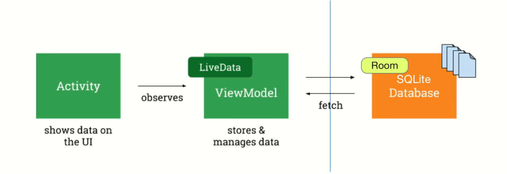
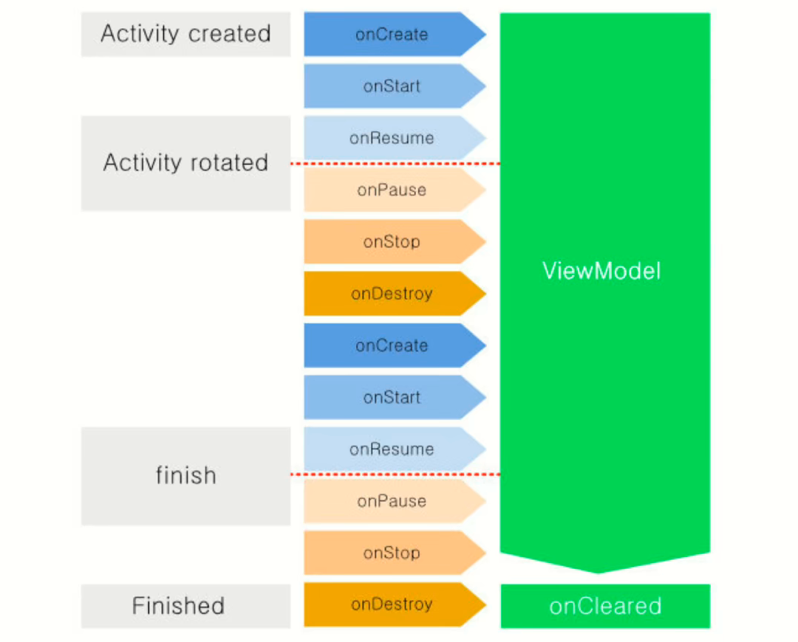

# ViewModel

## 介绍

[ViewModel  | Android Developers (google.cn)](https://developer.android.google.cn/reference/kotlin/androidx/lifecycle/ViewModel)

ViewModel is a class that is responsible for preparing and managing the data for an `Activity` or a `Fragment`. It also handles the communication of the Activity / Fragment with the rest of the application (e.g. calling the business logic classes).



ViewModel将数据从UI层抽象出来



由ViewModel管理的数据独立于Activity的生命周期之外。

ViewModel与LiveData配合实现对数据的监听。

## 实现

1. 创建MyViewModel类，并声明需要存放的数据

   ```kotlin
   class MyViewModel : ViewModel() {
       var number: Int = 0
   }
   ```

2. 在Activity中声明MyViewModel类

   ```kotlin
   private lateinit var myViewModel: MyViewModel
   ```

3. 在onCreate方法中实例化

   ```kotlin
   myViewModel = ViewModelProvider(this)[MyViewModel::class.java]
   ```

4. 使用MyViewModel中的成员变量

   ```kotlin
   textView.text = myViewModel.number.toString()
   ```

   