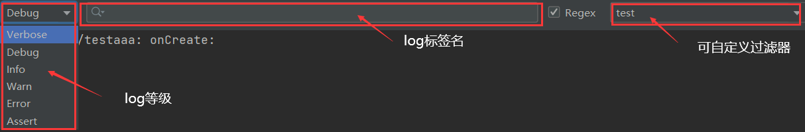
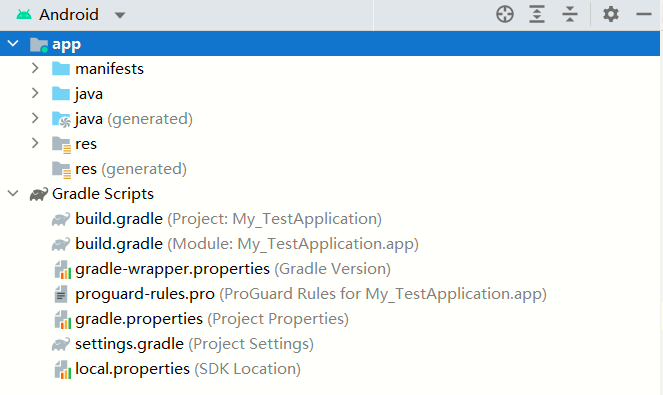

# Android 预备知识

- [Android 预备知识](#android-预备知识)
  - [App运行日志](#app运行日志)
  - [APP 工程文件目录结构](#app-工程文件目录结构)
  - [Gradle](#gradle)

## App运行日志
Android 采用Log工具打印日志，它将各类日志划分为五个等级：

- `Log.e`：表示错误信息，比如可能导致程序崩溃的异常。
- `Log.w`：表示警告信息。
- `Log.i`：表示一般消息。
- `Log.d`：表示调试信息，可把程序运行时的变量值打印出来，方便跟踪调试。
- `Log.v`：表示冗余信息。

## APP 工程文件目录结构

App工程分为两个层次，第一个层次是项目，另一个层次是模块。模块依附于项目，每个项目至少有一个模块，也能拥有多个模块。一般所言的“编译运行App”，指的是运行某个模块，而非运行某个项目，因为模块才对应实际的App。

从图中看到，该项目下面有两个分类：一个是 app(代表app模块)；另一个是 Gradle Scripts。其中，app 下面又有3个子目录，其功能说明如下：
(1) manifests 子目录，下面只有一个XML文件，即AndroidManifest.xml，它是 App 的运行配置文件。
(2) java子目录，下面有3个com.example.myapp包，其中第一个包存放当前模块的Java源代码，后面两个包存放测试用的Java代码。
(3) res子目录，存放当前模块的资源文件。res下面又有4个子目录：
- drawable目录存放图形描述文件与图片文件。
- layout目录存放App页面的布局文件。
- mipmap目录存放App的启动图标。
- values目录存放一些常量定义文件，例如字符串常量strings.xml、像素常量dimens.xml、颜色常量colors.xml、样式风格定义styles.xml等。

Gradle scripts 下面主要是工程的编译配置文件，主要有：
(1) `build.gradle`，该文件分为项目级与模块级两种，用于描述App工程的编译规则。
(2) `proguard-rules.pro`，该文件用于描述Java代码的混淆规则。
(3) `gradle.properties`，该文件用于配置编译工程的命令行参数，一般无须改动。
(4) `settings.gradle`，该文件配置了需要编译哪些模块。初始内容为`include ':app'`，表示只编译 app 模块。
(5)`local.properties`，项目的本地配置文件，它在工程编译时自动生成，用于描述开发者电脑的环境配置，包括SDK的本地路径、NDK的本地路径等。

## Gradle

Gradle 是一个项目自动化构建工具，帮我们做了依赖、打包、部署、发布、各种渠道的差异管理等工作。

