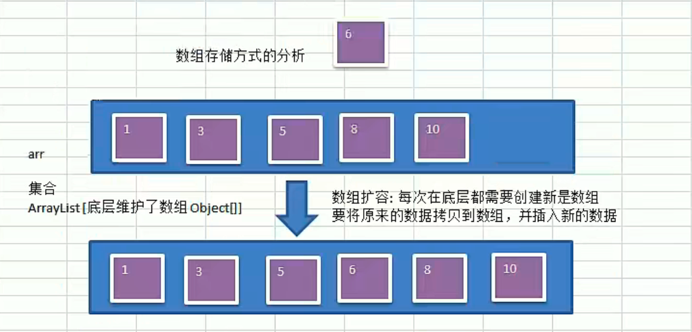
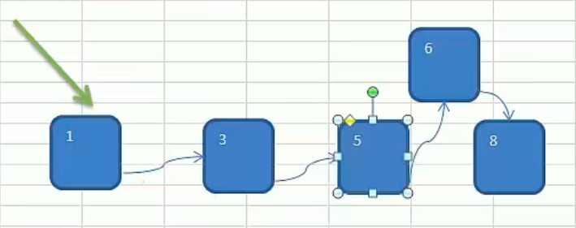
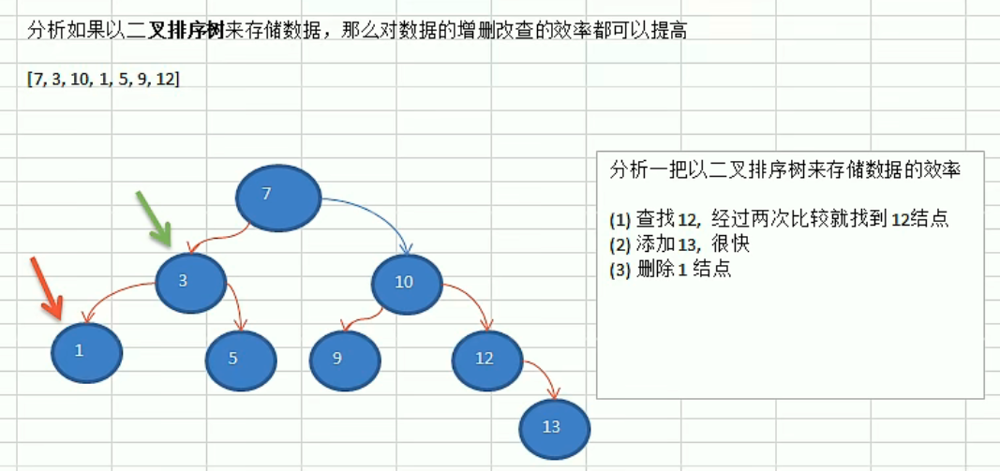
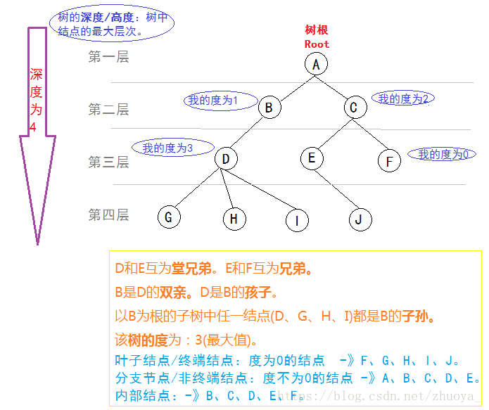
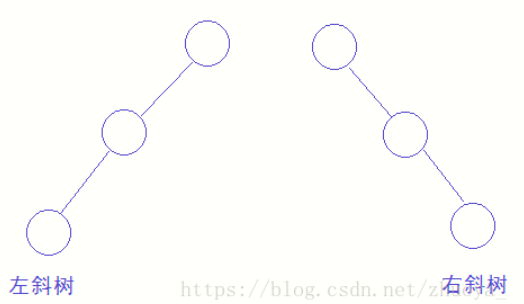
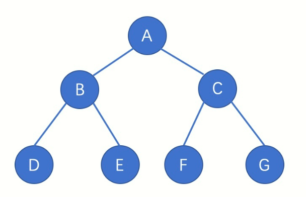
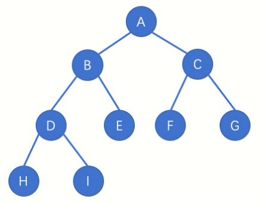

# 二叉树

## 为什么需要树这种数据结构

1. 数组存储方式的分析
优点：通过下标方式访问元素，速度快。对于有序数组，还可使用二分查找提高检索速度。
缺点：如果要检索具体某个值，或者插入值(按一定顺序)会整体移动，效率较低。

    

2. 链式存储方式的分析
优点：在一定程度上对数组存储方式有优化（比如：插入一个数值节点，只需要将插入节点，链接到链表中即可，删除效率也很好）。
缺点：在进行检索时，效率仍然较低，比如（检索某个值，需要从头节点开始遍历）。
    
3. 树存储方式的分析
二叉排序能提高数据存储，读取的效率，比如利用二叉排序树(Binary Sort Tree)，既可以保证数据的检索速度，同时也可以保证数据的插入，删除，修改的速度。
    

## 树的概念

树(Tree)是n(n≧0)个结点的有限集。n=0时称为空树。在任意一颗非空树中：有且仅有一个特定的称为根的结点。当n>1时，其余结点可分为m(m>0)个互不相交的有限集T1、T2、T3……、Tm，其中每个集合本身又是一棵树，并且称为根的子树。

## 树的术语

（一）节点的度：一个节点含有的子树的个数称为该节点的度
（二）树的度：一棵树中，最大的节点的度称为树的度
（三）叶节点或终端节点：度为0的节点
（四）父亲节点或父节点：若一个节点含有子节点，则这个节点 称为其子节点的父节点
（五）孩子节点或子节点：一个节点含有的子树的根节点称为该节点的子节点
（六）兄弟节点：具有相同父节点的节点互称为兄弟节点
（七）节点的层次：从根开始定义起，根为第一层， 根的子节点为第二层，以此类推
（八）树的高度或深度：树中节点的最大层次
（九）堂兄弟节点：父节点在同一层的节点互为堂兄弟节点
（十）节点的祖先：从根到该节点所经分支上的所有节点
（十一）子孙：以某节点为根的子树中任一节点都称为该节点的子孙
（十二）森林：由m(m>=0)棵互不相交的树的集合称为森林

## 二叉树

二叉树是n(n>=0)个结点的有限集合，该集合或者为空集（空二叉树）、或者由一个根结点和两颗互不相交的、分别称为根结点的左子树和右子树的二叉树组成。

特点：
- 二叉树中每个结点最多有两颗子树，度没有超过2的。
- 左子树和右子树是有顺序的，不能颠倒。

## 二叉树的形态

（1）空二叉树树

（2）只有一个根结点

（3）根结点只有左子树

（4）根结点只有右子树

（5）根结点既有右子树又有右子树

## 特殊二叉树

1. 斜树
   - 左斜树：所有结点都只有左子树的二叉树
   - 右斜树：所有结点都只有右子树的二叉树
   

2. 满二叉树

   在二叉树中，所有的分支结点都有左子树和右子树，并且所有的叶子都在同一层。该二叉树的所有叶子节点都在最后一层，并且结点总数为 $2^n - 1$ ，n为层数。
   
   
3. 完全二叉树
   - 叶子节点只能出现在最下两层。
   - 最下层的叶子一定集中在左部连续位置。
   - 倒数第二层，若有叶子结点，一定在右部连续位置。
   - 如果结点度为1，则该结点只有左孩子。
   - 同样结点的二叉树，完全二叉树的深度最小。
   