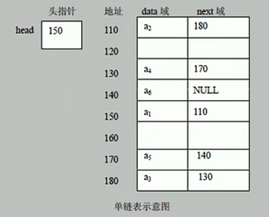
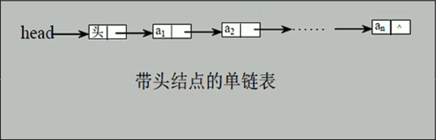

# 链表

## 基本介绍 

链表是有序的列表，但是它在内存中是存储如下



1. 链表是以节点的方式来存储
2. 每个节点包含data域， next域：指向下一个节点
3. 如图：发现链表的各个节点不一定是连续存储
4. 链表分带头节点的链表和没有头节点的链表，根据实际的需求来确定

单链表（带头结点）的逻辑结构



## 实现思路

### 添加（创建)

1. 先创建一个head头节点,作用就是表示单链表的头
2. 每添加一个节点，默认加入到链表的最后
3. 如果要添加新节点newNode到指定位置，要创建辅助指针temp，通过遍历找到新添加的节点的位置，然后将`newNode.next = temp.next`，将`temp.next = newNode`

### 遍历

通过一个辅助指针，辅助遍历整个链表

### 修改

先遍历链表，找到要修改的节点位置，用新节点的信息替换旧节点

### 删除

1. 使用辅助指针temp，找到并指向需要删除的节点的前一个结点
2. `temp.next = temp.next.next`
3. 被删除的节点将不会有引用指向，会被垃圾回收机制回收

## 代码实现

```java
public class SingleLinkedListDemo {
    public static void main(String[] args) {

        // 创建节点
        HeroNode hero_1 = new HeroNode(1, "宋江", "及时雨");
        HeroNode hero_2 = new HeroNode(2, "卢俊义", "玉麒麟");
        HeroNode hero_3 = new HeroNode(3, "吴用", "智多星");
        HeroNode hero_4 = new HeroNode(4, "公孙胜", "入云龙");
        HeroNode hero_5 = new HeroNode(5, "林冲", "豹子头");

        // 创建链表
        SingleLinkedList singleLinkedList = new SingleLinkedList();
        // 加入
//        singleLinkedList.add(hero_1);
//        singleLinkedList.add(hero_2);
//        singleLinkedList.add(hero_3);
//        singleLinkedList.add(hero_4);
//        singleLinkedList.add(hero_5);

        // 按照编号顺序添加
        singleLinkedList.addByOrder(hero_1);
        singleLinkedList.addByOrder(hero_4);
        singleLinkedList.addByOrder(hero_3);
        singleLinkedList.addByOrder(hero_2);
        singleLinkedList.addByOrder(hero_5);

        System.out.println("原始链表");
        singleLinkedList.list();

        singleLinkedList.update(new HeroNode(5, "林冲u", "豹子头u"));
        singleLinkedList.update(new HeroNode(6, "林冲u", "豹子头u"));
        // 输出链表
        System.out.println("修改后链表");
        singleLinkedList.list();

        singleLinkedList.del(5);
        singleLinkedList.del(2);
        singleLinkedList.del(1);
        System.out.println("删除后链表");
        singleLinkedList.list();
    }
}

// 定义SingleLinkedList 管理英雄
class SingleLinkedList {

    // 初始化一个头节点
    private HeroNode head = new HeroNode(0, "", "");

    // 添加节点到单向链表
    // 1. 找到当前链表的最后节点
    // 2. 将最后这个节点的next指向新的节点
    public void add(HeroNode heroNode) {

        // 因为 head节点不能动，因此我们需要一个辅助变量 temp
        HeroNode temp = head;
        // 遍历链表，找的最后节点
        while (true) {
            // 找到链表的最后
            if (temp.next == null) {
                break;
            }
            // 没有找到最后，将temp后移
            temp = temp.next;
        }
        // 当退出while循环时，temp就指向链表最后
        temp.next = heroNode;
    }

    // 第二种方式在添加英雄时,根据排名将英雄插入到指定位置
    // (如果有这个排名,则添加失败,并给出提示)
    public void addByOrder(HeroNode heroNode) {
        // 因为 head节点不能动，因此我们需要一个辅助变量 temp
        // 因为单链表，因为我们找的temp是位于添加位置的前一个节点，否则插入不了
        HeroNode temp = head;
        boolean flag = false; // 标志添加的编号是否存在,默认为false
        while (true) {
            if (temp.next == null) {
                break;
            }
            if (temp.next.no > heroNode.no) {
                // 位置找到,就在temp的后面插入
                break;
            } else if (temp.next.no == heroNode.no) {
                // 说明希望添加的heroNode的编号已然存在
                flag = true;
                break;
            }
            temp = temp.next; // 后移，遍历当前链表
        }
        // 判断flag的值

        if (flag) {
            // 不能添加，说明编号已存在
            System.out.printf("准备插入的英雄编号 %d 已经存在了，不能加入\n", heroNode.no);
        } else {
            // 插入链表中，temp的后面
            heroNode.next = temp.next;
            temp.next = heroNode;
        }
    }

    // 根据no编号修改节点信息
    public void update(HeroNode newHeroNode) {
        // 判断是否为空
        if (head.next == null) {
            System.out.println("链表为空");
            return;
        }
        // 根据no编号找到需要修改的节点
        HeroNode temp = head.next;
        boolean flag = false; // 表示是否找到该节点
        while (true) {
            if (temp == null) {
                break; // 链表遍历完毕
            }
            if (temp.no == newHeroNode.no) {
                // 找到
                flag = true;
                break;
            }
            temp = temp.next;
        }
        if (flag) {
            // 找到
            temp.name = newHeroNode.name;
            temp.nickName = newHeroNode.nickName;
        } else {
            System.out.printf("没有找到编号为 %d 的节点\n", newHeroNode.no);
        }
    }

    //删除指定节点
    public void del(int no) {
        HeroNode temp = head;
        boolean flag = false; // 标志是否找到代删除的节点
        while (true) {
            if (temp.next == null) {
                break;
            }
            if (temp.next.no == no) {
                //找到了待删除节点的前一个节点
                flag = true;
                break;
            }
            temp = temp.next;
        }
        if (flag) {
            temp.next = temp.next.next;
        } else {
            System.out.printf("待删除的节点 %d 不存在\n", no);
        }
    }

    // 遍历链表
    public void list() {
        // 判断链表是否为空
        if (head.next == null) {
            System.out.println("链表为空");
            return;
        }
        // 因为 head节点不能动，因此我们需要一个辅助变量 temp
        HeroNode temp = head.next;
        while (true) {
            // 判断是否到链表最后
            if (temp == null) {
                break;
            }
            System.out.println(temp);
            temp = temp.next;
        }
    }

}

// 定义HeroNode，每个HeroNode 对象就是一个节点
class HeroNode {
    public int no;
    public String name;
    public String nickName;
    public HeroNode next; // 指向下一个节点

    // 构造器
    public HeroNode(int no, String name, String nickName) {
        this.no = no;
        this.name = name;
        this.nickName = nickName;
    }

    @Override
    public String toString() {
        return "HeroNode{" +
                "no=" + no +
                ", name='" + name + '\'' +
                ", nickName='" + nickName + '\'' +
                '}';
    }
}

```