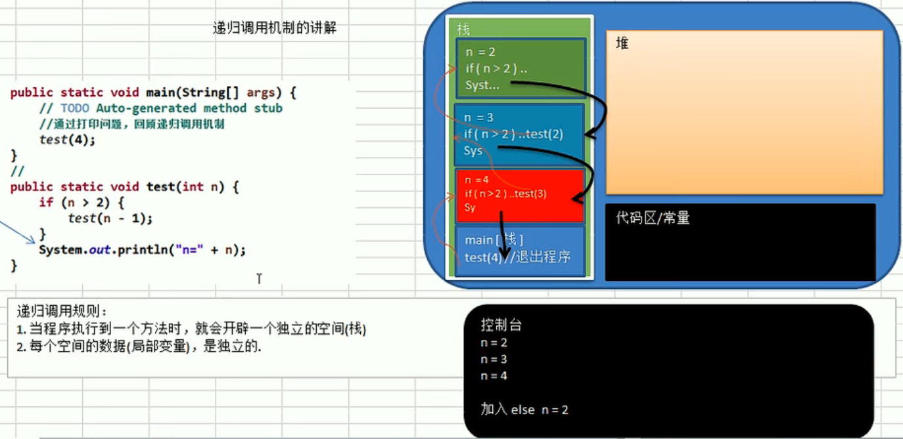

# 递归

- [递归](#递归)
  - [基本介绍](#基本介绍)
    - [递归需要遵守的重要规则](#递归需要遵守的重要规则)
    - [递归可解决的问题](#递归可解决的问题)
    - [迷宫回溯问题](#迷宫回溯问题)

## 基本介绍

递归（recursion）就是方法自己调用自己，每次调用时传入不同的变量。递归有助于编程者解决复杂的问题，同时可以让代码变得简洁。



### 递归需要遵守的重要规则
1. 执行一个方法时，就创建一个新的受保护的独立空间(栈空间)
2. 方法的局部变量是独立的，不会相互影响
3. 如果方法中使用的是引用类型变量，就会共享该引用类型的数据。
4. 递归必须向退出递归的条件逼近，否则就是无限递归，死龟了:)
5. 当一个方法执行完毕，或者遇到 return，就会返回，遵守谁调用，就将结果返回给谁，同时当方法执行完毕或者返回时，该方法也就执行完毕。

### 递归可解决的问题

1. 各种数学问题如：8皇后问题，汉诺塔，阶乘问题，迷宫问题，球和篮子的问题(google编程大赛)
2. 各种算法中也会使用到递归，比如快排，归并排序，二分查找，分治算法等。
3. 将用栈解决的问题->第归代码比较简洁

### 迷宫回溯问题

使用递归解决迷宫回溯问题

```java
import java.util.Random;

public class Maze {

    // 地图基本属性
    private int length;
    private int width;
    private int[][] map;
    private int endX;
    private int endY;

    // 地图构造器
    public Maze(int length, int width) {
        // 最小3X3
        if (length < 3 || width < 3) {
            throw new RuntimeException("数值不合法");
        }
        this.length = length;
        this.width = width;
        this.map = new int[length][width];
        // 默认终点右下角
        endX = length - 2;
        endY = width - 2;
        // 填充 0
        for (int i = 0; i < length; i++) {
            for (int j = 0; j < width; j++) {
                map[i][j] = 0;
            }
        }
        // 上下边为 1
        for (int i = 0; i < width; i++) {
            map[0][i] = 1;
            map[length - 1][i] = 1;
        }
        // 左右边为 1
        for (int i = 0; i < length; i++) {
            map[i][0] = 1;
            map[i][width - 1] = 1;
        }
    }

    public int[][] getMap() {
        return map;
    }

    public void setMap(int[][] map) {
        this.map = map;
    }

    public int getEndX() {
        return endX;
    }

    public void setEndX(int endX) {
        this.endX = endX;
    }

    public int getEndY() {
        return endY;
    }

    public void setEndY(int endY) {
        this.endY = endY;
    }

    // 打印地图
    public void printMap() {
        System.out.printf("\033[34m" + "%d\t", 0);
        for (int i = 0; i < this.length; i++) {
            System.out.printf("\033[34m" + "%d\t", i);
        }
        System.out.println();
        for (int i = 0; i < this.length; i++) {
            System.out.printf("\033[34m" + "%d\t", i);
            for (int j = 0; j < this.width; j++) {
                if (map[i][j] == 2) {
                    System.out.printf("\033[31m" + "%d\t", map[i][j]);
                } else if (map[i][j] == 1) {
                    System.out.printf("\033[32m" + "%d\t", map[i][j]);
                } else {
                    System.out.printf("\033[30m" + "%d\t", map[i][j]);
                }
            }
            System.out.println();
        }
    }

    // 设置障碍
    public void setBarrier(int x, int y) {
        if (x * y < 0 && x > length - 1 && y > width - 1) {
            throw new RuntimeException("数值错误");
        }
        map[x][y] = 1;
    }

    // 设置终点
    public void setEnd(int x, int y) {
        this.endX = x;
        this.endY = y;
    }

    public void setRandomBarrier(int times) {
        int x;
        int y;
        Random random = new Random();
        for (int i = 0; i < times; i++) {
            x = random.nextInt(width - 1);
            y = random.nextInt(length - 1);
            setBarrier(x, y);
        }
    }

    // 计算路线1
    public boolean getWay1(int x, int y) {
        if (map[endX][endY] == 2) {
            // 表示找到
            return true;
        } else {
            if (map[x][y] == 0) {
                map[x][y] = 2;
                // 右-下-左-上
                if (getWay1(x, y + 1)) {
                    return true;
                } else if (getWay1(x + 1, y)) {
                    return true;
                } else if (getWay1(x, y - 1)) {
                    return true;
                } else if (getWay1(x - 1, y)) {
                    return true;
                } else {
                    // 死路
                    map[x][y] = 3;
                    return false;
                }
            } else {
                return false;
            }
        }
    }

    // 计算路线2
    public boolean getWay2(int x, int y) {
        if (map[endX][endY] == 2) {
            // 表示找到
            return true;
        } else {
            if (map[x][y] == 0) {
                map[x][y] = 2;
                // 下-右-上-左
                if (getWay2(x + 1, y)) {
                    return true;
                } else if (getWay2(x, y + 1)) {
                    return true;
                } else if (getWay2(x - 1, y)) {
                    return true;
                } else if (getWay2(x, y - 1)) {
                    return true;
                } else {
                    // 死路
                    map[x][y] = 3;
                    return false;
                }
            } else {
                return false;
            }
        }
    }

    // 还原
    public void restore() {
        for (int i = 0; i < this.length; i++) {
            for (int j = 0; j < this.width; j++) {
                if (map[i][j] == 3) {
                    map[i][j] = 0;
                } else if (map[i][j] == 2) {
                    map[i][j] = 0;
                }
            }
        }
    }
}
```
测试类：
```java
public class TestMaze {
    public static void main(String[] args) {
        // 7 行 8 列
        Maze maze = new Maze(20, 20);
        maze.setRandomBarrier(100);
        maze.setEnd(9,9);
        maze.getWay1(1, 1);
        maze.printMap();
        maze.restore();
        maze.getWay2(1,1);
        maze.printMap();
    }
}
```