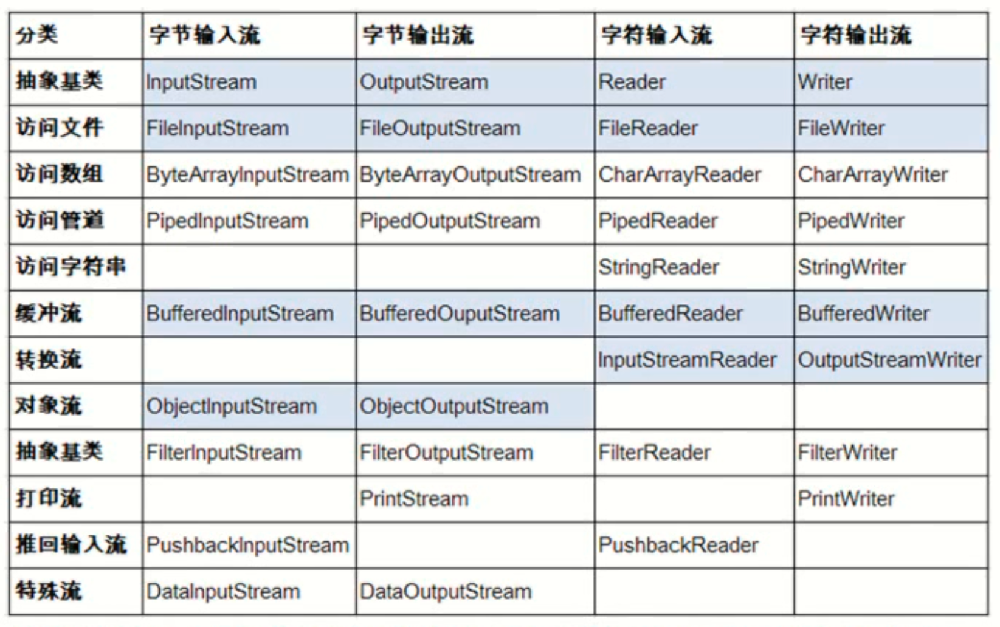

# Java IO

### IO概述
Java的IO流主要包括输入、输出两种IO流，每种输入输出流有可分为字节流和字符流两大类:

### File类
File类代表与平台无关的文件和目录。
File能新建、删除、重命名文件和目录，但File 不能访问文件内容本身。如果需要访问文件内容本身，则需要使用输入/输出流。
相关方法：
```java
import org.junit.Test;
import java.io.File;
import java.io.IOException;

public class IOTest {

    @Test
    public void testFile() throws IOException {
        //创建File对象
        File file = new File("file.txt");

        //测试File对象的方法
        //文件名相关的方法
        String fileName = file.getName();
        System.out.println(fileName);

        //访问文件的绝对路径
        String path = file.getAbsolutePath();
        System.out.println(path);

        //为文件重命名
        file.renameTo(new File("d:\\hello.txt"));

        //文件检测相关方法
        System.out.println(file.exists());//false

        File dir = new File("hello");
        System.out.println(dir.isDirectory());//true

        //获取文件的常规信息
        System.out.println(file.length());

        //文件操作相关
        //新建文件
        File file1 = new File("aa.txt");
        file1.createNewFile();
    }
}
```
### IO流分类
按流向分：

- 输入流
- 输出流  

按处理的单位：

- 字节流(8位的字节)
- 字符流(16位的字节)  

按流的角色：

- 节点流:可以从一个特定的IO设备读/写数据的流
- 处理流:对一个已存在的流进行连接和封装，通过封装后的流来实现数据读/写操作

IO流体系 



### lnputStream & Reader
InputStream和 Reader是所有输入流的基类。
InputStream(典型实现:FileInputStream ) :
```java
- int read()
- int read(byte[ b)
- int read(bytel b, int off, int len)
```
Reader (典型实现:FileReader ) :
```java
- int read()
- int read(char [ c)
- int read(char[ c, int off, int len)
```
程序中打开的文件IO资源不属于内存里的资源，垃圾回收机制无法回收该资源，所以应该显式关闭文件IO资源。
实例：
字节输入流
```java
//字节输入流，本段代码仅示例，实际运行要注释掉一部分
@Test
public void testInputStream() throws IOException {
    //创建一个字节输入流
    InputStream in = new FileInputStream("file.txt");
    //读取文件的内容
    //读取一个字节,效率很低，不建议，
    int result = in.read();

    //-1表示读取到文件的末尾
    while (result != -1) {
           System.out.print((char) result);
           result = in.read();
    }
        一次读一组,一组10个字节
    byte[] buffer = new byte[10];
    int len = 0;

    //返回读取的字节数，若为-1表示读取到文件的结尾
    while ((len = in.read(buffer)) != -1) {
        //末尾容易出错
        for (byte b : buffer) {
            System.out.print((char) b);
        }
        for (int i = 0; i < len; i++) {
            System.out.print((char) buffer[i]);
        }
    }

    //把内容读取到字节数组的部分连续的元素中
    byte[] result = new byte[1024 * 10];
    in.read(result, 10, in.available());

    //关闭流资源
    in.close();
}
```
字符输入流
```java
//字符输入流
@Test
public void testReader() throws IOException {
    //利用字符输入流读取hello.txt文档的内容，输出到控制台.
    Reader reader = new FileReader("file.txt");

    char[] buffer = new char[10];
    int len = 0;
    while ((len = reader.read(buffer)) != -1) {
        for (int i = 0; i < len; i++) {
            System.out.print(buffer[i]);
        }
    }
}
```
### OutputStream & Writer

OutputStream和Writer也非常相似:
```java
- void write(byte write/int c)
- void []/char[] buff)
- void write(byte[]/char[] buff, int off, int len);
```
因为字符流直接以字符作为操作单位，所以 Writer可以用字符串来替换字符数组，即以 String对象作为参数
```java
- void write(String str);
- void write(String str, int off, int len)
```
实例：
```java
    //测试字节输出流
    @Test
    public void testOutputStream() throws IOException {
        OutputStream out = new FileOutputStream("abcd.txt");

        String content = "www.yorick.com\n\rHello Yorick";
//        byte[] buffer = new byte[10];
//        int len = 10;
//
//        int time = content.length() / 10;
//
//
//        byte[] contentBytes = content.getBytes();
//
//        for (int i = 0; i < content.length() / 10; i++) {
//            //把String拆分为多个buffer
//            out.write(contentBytes, i * 10, len);
//        }
//
//        if (content.length() % 10 != 0) {
//           out.write(contentBytes,10*(content.length()/10),
//                   content.length()-10*(content.length()/10));
//        }

        out.write(content.getBytes(StandardCharsets.UTF_8));

        out.close();
    }
```
文件复制实例：

利用字节输入输出流。完成hello.txt文件的复制把该文件复制为hello2.txt
```java
@Test
public void testCopyFile() throws IOException{
    //1。创建定位到hello.txt的文件的输入流
    InputStream in = new FileInputStream("hello.txt");
    //2．创建定位到 hello2.txt的文件输出流
    OutputStream out = new FileOutputStream("hello2.txt");
    //3．创建一个 byte数组，用于读写文件
    byte [] buffer = new byte[ 1024*10];
    int len = 0;
    //4．读写文件:
    //in.read( buffer); out.write(buffer, 0, len);
    while ((len =in.read(buffer)) !=-1){
        out.write(buffer,0,len);
    }
    //5. 关闭流资源
    in.close();
    out.close();
}
```
利用字符输入输出流。完成hello.txt文件的复制把该文件复制为hello2.txt
```java
@Test
public void testCopyByReaderAndWriter() throws IOException {
    //1，创建字符输入，输出流
    Reader reader = new FileReader("hello.txt");
    Writer writer = new FileWriter("hello2.txt");
    //3. 创建一个字符数组。
    char[] buffer = new char[10];
    //4. 利用循环读取源文件，并向目标文件写入
    //5. 注意:使用的写入的方法:write(char[] buf，int off, int len)
    //而不能直接使用write(char[] buf)|
    int len = 0;
    while ((len = reader.read(buffer)) != -1) {
        writer.write(buffer, 0, len);
        System.out.println(len);
    }
    //2. 关闭流资源
    reader.close();
    writer.close();
}
```
### 缓冲流
文件复制
```java
//复制hello.txt 为 hello3.txt
@Test
public void testBufferedReaderAndBufferedWrite() throws IOException {
    //1。创建 BufferedReader和 BufferedWriter
    BufferedReader bufferedReader = new BufferedReader(new FileReader("hello.txt"));
    BufferedWriter bufferedWriter = new BufferedWriter(new FileWriter("hello3.txt"));

    //2. 进行读写操作
    String str = null;

    int i = 0;

    while ((str = bufferedReader.readLine()) !=null) {
        if (i != 0)
            bufferedWriter.write("\n");
        bufferedWriter.write(str);
        i++;
    }

    //3.关闭IO流,直接关闭包装流 ，内部会关闭节点流
    bufferedReader.close();
    bufferedWriter.close();
}
```
```java
@Test
public void testBufferedInputStreamAndBufferedOutputStream()throws IOException{
    BufferedInputStream bIS = new BufferedInputStream(new FileInputStream("hello.txt"));
    BufferedOutputStream bOT = new BufferedOutputStream(new FileOutputStream("hello4.txt"));

    byte [] buffer = new byte[1024];
    int len = 0;

    while ((len = bIS.read(buffer))!= -1){
        bOT.write(buffer,0,len);
    }

    bIS.close();
    bOT.close();
}
```
### RandomAccessFile类
### 对象的序列化
