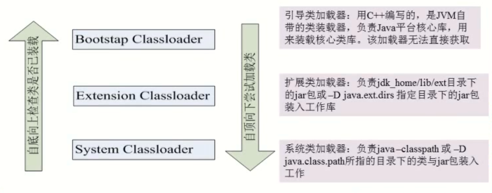

# Java反射

- [Java反射](#java反射)
  - [Class类](#class类)
    - [获取Class对象](#获取class对象)
    - [Class类的常用方法](#class类的常用方法)
    - [类加载器](#类加载器)

## Class类

- 关于Class:
  1. class是一个类
  2. 对象照镜子后可以得到的信息：某个类的数据成员名、方法和构造器、某个类到底实现了哪些接口；
  3. 对于每个类而言，JRE 都为其保留一个不变的Class类型的对象。一个Class对象包含了特定某个类的有关信息。 

- Class对象只能由系统建立对象
- 一个类在JVM中只会有一个Class实例
- 每个类的实例都会记得自己是由哪个Class 实例所生成
### 获取Class对象
获取Class对象的三种方式
```java
@Test
public void testClass() throws ClassNotFoundException {
    Class clazz = null;
    //1.获取Class对象的方式
    //1.1直接通过 类名.class 的方式得到
    clazz = Person.class;
    //1.2通过对象调用 getClass() 方法获取
    Object obj = new Person();
    clazz = obj.getClass();
    //1.3通过全类名的方式获取（最常用）
    String className = "com.yur.java.Person";
    clazz = Class.forName(className);
    //Field[] fields= clazz.getDeclaredFields();//字段集合
    System.out.println();
}
```
### Class类的常用方法

`getConstructor()`返回指定参数类型public的构造器。
`getDeclaredConstructor()`返回指定参数类型的private和public构造器。但在使用private的构造器时，必须设置`setAccessible()`为true,才可以获取并操作该Constructor对象。

实例：
```java
package com.yur.java;

public class Person {
    private String name;
    private int age;

    //供反射使用
    public Person() {
        System.out.println("无参数的构造器");
    }

    public Person(String name, int age) {
        this.name = name;
        this.age = age;
        System.out.println("有参数的构造器");
    }

    public Person(String name) {
        this.name = name;
    }

    public String getName() {
        return name;
    }

    public void setName(String name) {
        this.name = name;
    }

    public int getAge() {
        return age;
    }

    public void setAge(int age) {
        this.age = age;
    }

    @Override
    public String toString() {
        return "Person{" +
                "name='" + name + '\'' +
                ", age=" + age +
                '}';
    }

    public void sayHello(){
        System.out.println("Hello"+name);
    }
}
```
测试：
```java
@Test
public void testNewInstance() throws ClassNotFoundException, NoSuchMethodException, InvocationTargetException, InstantiationException, IllegalAccessException {
    String className =   "com.yur.java.Person";
    Class clazz = Class.forName(className);
    //利用Class对象的getConstructor()方法来调用类的无参构造器
    Constructor constructor = clazz.getConstructor();
    //使用该无参构造构造实例
    Object obj = constructor.newInstance();
}
@Test
public void testNewInstance1() throws ClassNotFoundException, NoSuchMethodException, InvocationTargetException, InstantiationException, IllegalAccessException {
    String className =   "com.yur.java.Person";
    Class clazz = Class.forName(className);
    //利用Class对象的getDeclaredConstructor()方法来调用类的无参私有构造器
    Constructor constructor = clazz.getDeclaredConstructor();
    constructor.setAccessible(true);
    Object obj = constructor.newInstance();
}
@Test
public void testNewInstance2() throws ClassNotFoundException, NoSuchMethodException, InvocationTargetException, InstantiationException, IllegalAccessException {
    String className =   "com.yur.java.Person";
    Class clazz = Class.forName(className);
    //利用Class对象的getDeclaredConstructor()方法来调用类的有参构造器
    Constructor constructor = clazz.getDeclaredConstructor(String.class);
    //使用该够惨凄创建实例对象
    Object obj = constructor.newInstance("Yorick");
}
```
### 类加载器

ClassLoader
类装载器是用来把类(class)装载进JVM的。
JVM规范定义了两种类型的类装载器：启动类装载器(bootstrap)和用户自定义装载器(user-defined class loader)。JVM在运行时会产生3个类加载器组成的初始化加载器层次结构，如下图所示：



实例：

```java
@Test
public void testClassLoader() throws ClassNotFoundException, FileNotFoundException {
    //1.获取一个系统的类加载器
    ClassLoader classLoader = ClassLoader.getSystemClassLoader();
    System.out.println(classLoader);
    //2.获取系统类加载器的父类加载器
    classLoader = classLoader.getParent();
    System.out.println(classLoader);
    //3.获取扩展类加载器的父类加载器.
    classLoader = classLoader.getParent();
    System.out.println(classLoader);
    //4.测试当前类由哪个类加载器加载
    classLoader = Class.forName("com.yur.java.Person").getClassLoader();
    System.out.println(classLoader);
    //5.测试JDK 提供的Object 类由哪个类加载器负责加载
    classLoader = Class.forName("java.lang.Object").getClassLoader();
    System.out.println(classLoader);
    //6.关于类加载器的主要方法（重要）
    //调用getResourceAsStream获取类路径下的文件对应的输入流·
    //InputStream in = new FileInputStream("test.properties");
    InputStream in = null;
    in = this.getClass().getClassLoader().getResourceAsStream("test.properties");
    System.out.println(in);
}
```