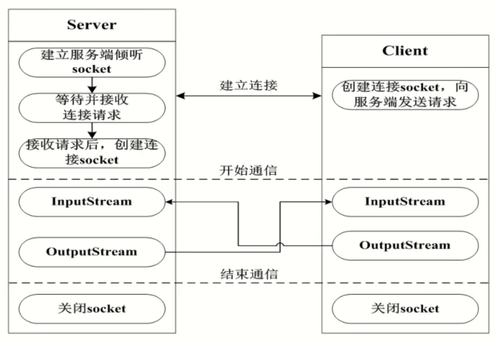

# Java网络编程

- [Java网络编程](#java网络编程)
  - [TCP/IP编程基础](#tcpip编程基础)
    - [lnetAdress类](#lnetadress类)
    - [IP和端口号](#ip和端口号)
    - [TCP程序设计](#tcp程序设计)
    - [TCP网络编程](#tcp网络编程)
  - [URL & URLConnection](#url--urlconnection)

网络编程的目的就是指值接或间接地通过网络协议与其它计算机进行通讯。

网络编程中有两个主要的问题，
- 如何准确地定位网络上一台或多台主机
- 找到主机后如何可靠高效地进行数据传输。 
  
要想让处于网络中的主机互相通信，只是知道通信双方地址还是不够的了，还必须遵循一定的规则。有两套参考模型：

- OSI参考模型:模型过于理想化，未能在因特网上进行广泛推广
- TCP/IP参考模型(或TCPAIP协议)：事实上的国际标准。


## TCP/IP编程基础

### lnetAdress类

InetAddress类对象含有一个Internet主机地址的域名和IP地址:`www.yorick.com/101.43.43.234`
```java
InetAddress address = InetAddress.getByName("www.yorick.com");
System.out.println(address);
InetAddress address1 = InetAddress.getLocalHost();
System.out.println(address1);
//www.yorick.com/35.186.238.101
//YursPC/10.12.0.16
```
### IP和端口号

IP地址标识Internet 上的计算机，端口号标识正在计算机上运行的进程（程序)。

端口号与IP地址的组合得出一个网络套接字。

端口号被规定为一个16位的整数`0~65535`。其中，
`0~1023`被预先定义的服务通信占用（如telnet占用端口23，http占用端口80等）。除非我们需要访问这些特定服务否则，就应该使用`1024~65535`这些端口中的某一个进行通信，以免发生端口冲突。

### TCP程序设计
利用套接字(Socket)接口开发网络应用程序早已被广泛的采用，以至于成为事实上的标准。套接字能执行7种基本操作：

- 连接到远程主机
- 绑定到端口
- 接收从远程机器来的连接请求
- 监听到达的数据
- 发送数据
- 接收数据
- 关闭连接TCP网络编程
  
### TCP网络编程

两个Java应用程序可通过一个双向的网络通信连接实现数据交换，这个双向链路的一段称为一个Socket（套接字）。Socket通常用来实现`Client/Server`连接。

Java语言的基于套接字编程分为服务器编程和客户端编程，其通信模型如图所示：


实例：
```java
//客户端
@Test
public void testClientSocket() throws IOException {
    InetAddress address = InetAddress.getByName("127.0.0.1");
    //创建Socket对象同时向服务端发出请求
    Socket socket = new Socket(address, 9898);

    //通过输入输出流和服务端进行交互  
    InputStream inputStream = socket.getInputStream();
    BufferedReader reader =
            new BufferedReader(new InputStreamReader(inputStream));
    System.out.println("^_^:" + reader.readLine());

    inputStream.close();
    reader.close();
    socket.close();
}
//服务端
@Test
public void testServerSocket() throws IOException {
    //创建ServerSocket对象 
    ServerSocket serverSocket = new ServerSocket(9898);
    //接受客户端的请求，并得到Socket对象
    Socket socket = serverSocket.accept();

    //通过输入输出流和客户端进行交互  
    OutputStream outputStream = socket.getOutputStream();
    PrintWriter writer = new PrintWriter(outputStream);
    writer.write("来自服务端的问候  ");

    writer.close();
    outputStream.close();
    socket.close();
}
//^_^:来自服务端的问候
```
练习：服务端向客户端传递一个文件﹐客户端读取文件并保存到本地。

图示：

```java
@Test
public void testServerSocket1() throws IOException {
    ServerSocket serverSocket = new ServerSocket(8888);
    Socket socket = serverSocket.accept();
    InputStream in = new FileInputStream("flyCat.gif");
    byte[] buffer = new byte[1024];
    int len = 0;
    OutputStream outputStream = socket.getOutputStream();
    while ((len = in.read(buffer)) != -1) {
        outputStream.write(buffer, 0, len);
    }
    outputStream.close();
    in.close();
    socket.close();
    serverSocket.close();
}
@Test
public void testClientSocket1() throws IOException {
    InetAddress address = InetAddress.getByName("127.0.0.1");
    Socket socket = new Socket(address, 8888);
    InputStream in = socket.getInputStream();
    OutputStream outputStream = new FileOutputStream("d:\\flyCat.gif");
    byte[] buffer = new byte[1024];
    int len = 0;
    while ((len = in.read(buffer)) != -1) {
        outputStream.write(buffer, 0, len);
    }
    in.close();
    outputStream.close();
    socket.close();
}
```

## URL & URLConnection

URL (Uniform Resource Locator) ：统一资源定位符，它表示 Internet上某一资源的地址。通过URL我们可以访问Internet 上的各种网络资源，比如最常见的www , ftp站点。浏览器通过解析给定的URL可以在网络上查找相应的文件或其他资源。

URL的基本结构由5部分组成：
- <传输协议>://<主机名>:<端口号>/<文件名>
- 例如：http://192.168.1.100:8080/helloworld/index.jsp

示例：
```java
@Test
public void testURL() throws IOException {
    URL url = new URL("http://127.0.0.1:8080/examples/hello.txt");
    System.out.println(url.getPath());
    System.out.println(url.getFile());
    System.out.println(url.getQuery());
    //如url为：http://127.0.0.1:8080/examples/hello.txt?name=Yorick
    //获取name=Yorick
    URLConnection urlConnection = url.openConnection();
    System.out.println(urlConnection);
    InputStream in = urlConnection.getInputStream();
    FileOutputStream outputStream = new FileOutputStream("test.txt");
    byte[] buffer = new byte[1024];
    int len = 0;
    while ((len = in.read(buffer)) != -1) {
        outputStream.write(buffer, 0, len);
    }
    in.close();
    outputStream.close();
}
```