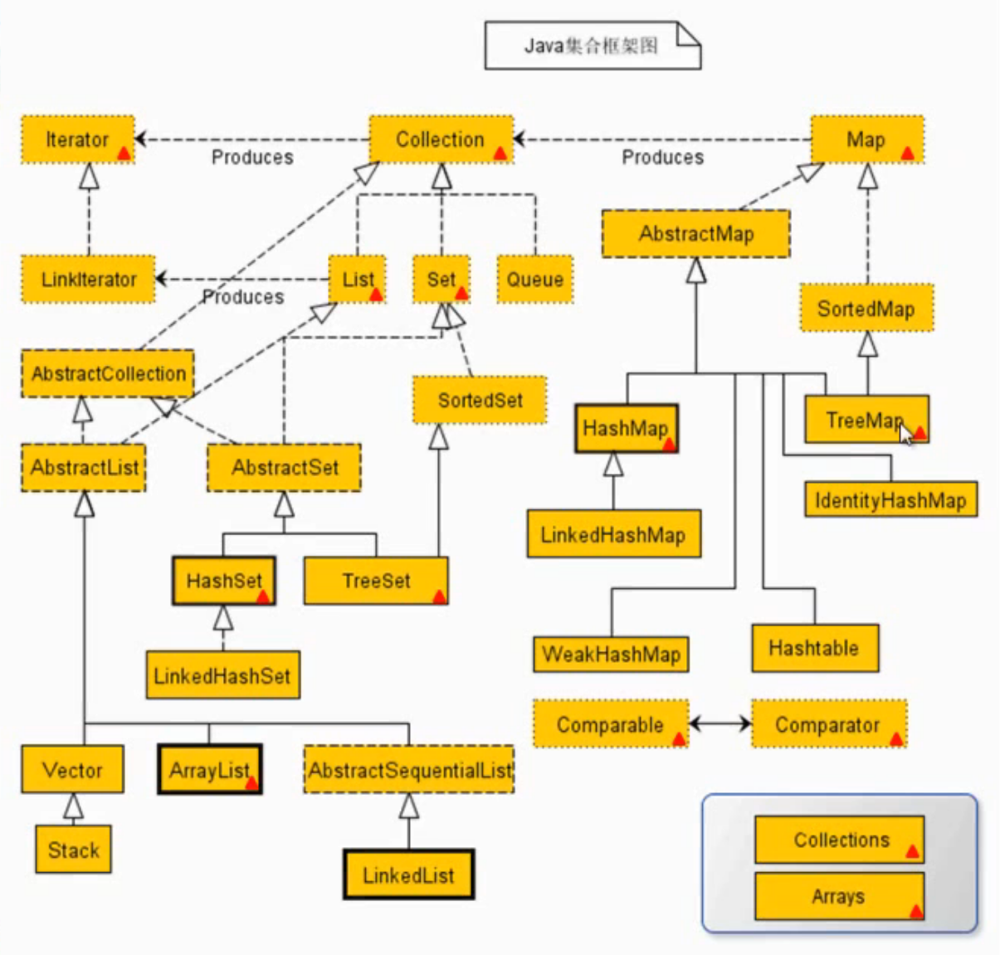

# Java集合

目录：
- [Java集合](#java集合)
    - [Collection](#collection)
      - [添加元素](#添加元素)
      - [访问集合的方法](#访问集合的方法)
      - [移除集合中的元素：](#移除集合中的元素)
      - [检测集合的方法](#检测集合的方法)
      - [集合的其他方法](#集合的其他方法)
    - [Set](#set)
      - [HashSet](#hashset)
      - [LinkedHashSet](#linkedhashset)
      - [TreeSet](#treeset)
    - [List](#list)

Java集合就像一种容器，可以把多个对象的引用放入容器中。  

Java集合类可以用于存储数量不等的多个对象，还可用于保存具有映射关系的关联数组。

Java集合可分为 Set、List 和 Map 三种体系
- Set：无序、不可重复的集合
- List：有序、可重复的集合
- Map：具有映射关系的集合

在Java5之前，Java集合会丢失容器中所有对象的数据类型，把所有对象都当成Object类型处理；从Java5增加了**泛型**以后，Java集合可以记住容器中对象的数据类型。



### Collection

创建一个Collection接口的对象

```java
Collection collection = new ArrayList();
```

#### 添加元素

1. `add()`参数为要添加的元素对象
    ```java
    collection.add(new Person());
    ```
2. `addAll()`参数为要添加的集合对象
    ```java
    Collection collection2 = new ArrayList();
    collection2.add(new Person());
    collection2.add(new Person());
    collection.addAll(collection2);
    ```

#### 访问集合的方法

1. `size()`获取集合长度
    ```java
    System.out.println(collection.size());
    ```
2. `iterator()`对集合进行遍历，`iterator()`可以得到对应的`Iterator`对象。
`Iterator`:迭代器
使用方法：
    ```java
    //获取Iterator接口对象
    Iterator iterator = collection.iterator();
    //使用while循环和Iterator遍历集合的每一个元素。
    //具体使用Iterator接口的hasNext()和next()方法。
    while (iterator.hasNext()){
        Object obj = iterator.next();
        System.out.println(obj);
    }
    ```
1. 使用增强for循环的方式来对集合进行遍历
    ```java
    for(Object obj: collection){
        System.out.println(obj);
    }
    ```
#### 移除集合中的元素：
1. `remove()`移除某一个指定的对象。通过`equals()`方法来判断要移除的那个元素在集合中是否存在，以及是否能够成功移除。参数为要移除的元素对象，返回是否成功的布尔值。  
    ```java
    boolean result = collection.remove(new Person());
    System.out.printIn(result);
    //返回：false
    ```
2. `removeAll()`参数为要移除的元素集合对象。
    ```java
    boolean result = collection.removeAll(collection2);
    System.out.printIn(result);
3. `clear()`使集合元素置空。
   ```java
   collection.clear()
   ```
#### 检测集合的方法
1. `contains()`检测集合是否包含某一元素
   ```java
   System.out.println(collection.contains(new Person()));
   //返回：false
   ```
2. `containsAll()`检测集合是否包含某一元素集合
   ```java
   System.out.println(collection.containsAll(collection2));
   ```
3. `isEmpty()`检测集合是否为空
   ```java
   System.out.println(collection.isEmpty());//false
   collection.clear();
   System.out.println(collection.isEmpty());//true
   ```
#### 集合的其他方法
1. `toArry()`
    ```java
    Object [] objects = collection.toArray();
    System.out.println(objects.length);
    ```
2. `toArry(T[])`涉及泛型
3. `equals()`比较两集合是否相等
   ```java
   //有序集合
   Collection collection3 = new ArrayList();
   collection3.add(p1);
   collection3.add(p2);
   Collection collection4 = new ArrayList();
   collection4.add(p2);
   collection4.add(p1);
   System.out.println(collection3.equals(collection4));
   //返回false

   //无序集合
   Collection collection3 = new HashSet();
   collection3.add(p1);
   collection3.add(p2);
   Collection collection4 = new HashSet();
   collection4.add(p2);
   collection4.add(p1);
   System.out.println(collection3.equals(collection4));
   //返回true
   ```
4. `hasCode()`
5. 使用增强for循环的方式来对集合进行遍历
   ```java
   for (Object obj : collection) {
       System.out.println(obj);
       }
   ```

### Set

1. Set是 Collection 的子接口
2. Set中不允许存放相同的元素。判定相同元素的标准是，两个对象**各**调用`equals()`方法，返回`true`。

#### HashSet

1. 不能保证元素的排列顺序
2. HashSet 不是线程安全的
3. 集合元素可以使`null`
4. 对于 HashSet：如果两个对象通过`equals()`方法返回 true，这两个对象的 hashCode 值也应该相同。
5. 由根据元素自身属性计算的 hashCode 决定位置，所以可重写hashCode实现重复（不推荐）和有序类似 LinkedHashSet

#### LinkedHashSet

1. LinkedHashSet 是 HashSet 的子类
2. 使用链表维护元素的次序，这使得元素看起来是以插入顺序保存的 
3. LinkedHashset 不允许集合元素重复
4. 重写类的`hashCode()`方法也可以在 HashSet 实现序列化

#### TreeSet

**自然排序**：TreeSet 会调用集合元素的`compareTo(Object obj)`方法来比较元素之间的大小关系，然后将集合元素按升序排列如果试图把一个对象添加到 TreeSet 时,则该对象的类必须实现 Comparable 接口。

实现 Comparable 的类必须实现`compareTo(Object obj)`方法，两个对象即通过`compareTo(Object obj)`方法的返回值来比较大小。

1. 因为只有相同类的两个实例才会比较大小，所以向 TreeSet 中添加的应该是**同一个类**的对象。

2. 当需要把一个对象放入 TreeSet 中,重写该对象对应的`equals()`方法时，应保证该方法与`compareTo(Object obj)`方法有一致的结果：如果两个对象通过`equals()`方法比较返回`true`，则通过`compareTo(Object obj)`方法比较应返回`0`。

**定制排序**

创建 TreeSet 对象时，传入 Comparator 接口实现的类。

要求：Comparator 接口的`compare()`方法的返回值和两个元素的`equals()`要一致。

### List
1. List 代表一个元素有序、且可重复的集合，集合中的每个元素都有其对应的顺序索引。
2. List 允许使用重复元素，可以通过索引来访间指定位置的集合元素。
3. List 默认按元素的添加顺序设置元素的索引。

方法：

- void add(int index, Objed ele)
- boolean addAll(int index, Collection eles)
- Object get(int index)
- int indexOf(Objed obj)
- int lastIndexOf(Objed obj)
- Object remove(int index)
- Object set(int index,Objed ele) 替换元素
- List subList(int fromlndex, int tolndex) 取区间内元素，前闭后开


